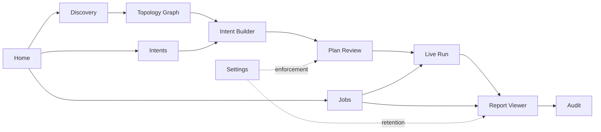

# MultiCap — Frontend / UX Specification

> **PySide6 UI product surface** (per [ADR-001](./stack-decision.md))

| Field | Value |
|---|---|
| **Project** | MultiCap — Cisco Multi-Platform Synchronized Packet Capture Orchestrator |
| **Document** | frontend-plan.md |
| **Version** | 1.1 (DRAFT) |
| **Date** | 2026-09-10 |
| **Owner** | Lakshmi Ganesh Kondaveeti — Technical Consulting Engineering Technical Leader |
| **Derived from** | [architecture.md](./architecture.md) v1.1, [implementation-plan.md](./implementation-plan.md) v1.2, [problemStatement.md](./problemStatement.md) v2.0 |
| **Governed by** | [stack-decision.md](./stack-decision.md) (ADR-001) |
| **Changelog** | v1.1 — Stack pivot per [ADR-001](./stack-decision.md): Electron/React/TS → PySide6/Qt Widgets/Python. §11 component inventory re-pathed from `packages/ui` to `src/multicap/app/widgets/` with React→QWidget mappings; §13 rewritten around QAccessible + Qt Linguist + `pytest-qt`; §16 open items #1 (design system) and #2 (topology library) closed by ADR-001 selections (qt-material + `QGraphicsScene`+NetworkX), #3 (ladder rendering) closed by `QGraphicsScene`+`QSvgGenerator`. Scope updated to Qt main-thread rendering. |
| **Scope** | Everything rendered on the Qt main thread inside the single PySide6 process (`src/multicap/app/`). Backend/orchestration remains in [implementation-plan.md](./implementation-plan.md). |

---

## Table of Contents

1. [UX Principles](#1-ux-principles)
2. [Screen Map & Navigation Model](#2-screen-map--navigation-model)
3. [Screen Contracts](#3-screen-contracts)
4. [Hero Flow A — Wired Path-Intent Capture](#4-hero-flow-a--wired-path-intent-capture)
5. [Hero Flow B — Three-Domain Client-MAC Wireless Capture](#5-hero-flow-b--three-domain-client-mac-wireless-capture)
6. [Consent & Gate UX](#6-consent--gate-ux)
7. [Live Run Screen — Detailed Spec](#7-live-run-screen--detailed-spec)
8. [Report Viewer — Detailed Spec](#8-report-viewer--detailed-spec)
9. [Settings Screen — Detailed Spec](#9-settings-screen--detailed-spec)
10. [Global UX Elements](#10-global-ux-elements)
11. [Component Inventory (`src/multicap/app/widgets/`)](#11-component-inventory-srcmulticapappwidgets)
12. [State, Errors, Empty & Degraded States](#12-state-errors-empty--degraded-states)
13. [Accessibility & Internationalization](#13-accessibility--internationalization)
14. [Wireframe Sketches — Hero Flows](#14-wireframe-sketches--hero-flows)
15. [Phase-to-Screen Traceability](#15-phase-to-screen-traceability)
16. [Open Items](#16-open-items)

---

## 1. UX Principles

Non-negotiable posture that every screen must reflect.

1. **Safety is legible, not hidden.** Every guardrail (safety-gate, consent gate, coverage-gap, NTP-degraded, change-ticket) is surfaced *before* the destructive action, never after. Modals do not stack; gates are consolidated.
2. **Coverage gaps are first-class UI objects.** A `coverage-gap` strategy renders as a distinct, colored, dismissible-only-with-acknowledgement banner — never as an empty row.
3. **Time-to-evidence over polish.** SC-9 (< 15 min wired 10-device, < 20 min three-domain wireless) is a UX target too. Every screen minimizes clicks on the two hero flows.
4. **Progressive disclosure.** Path-intent form is 3 fields on Layer 1; advanced filter/ACL builder is Layer 2. Novices ship a capture; experts tune it.
5. **Read-only by default in enforced mode.** When `enforcement-mode` is on ([impl §10](./implementation-plan.md#10-phase-5--safety-gate--cleanup-state-machine)), any action requiring a change-ticket ID is disabled until the field is filled.
6. **No silent failure.** Drop counters, truncation, NTP skew, HA SSO switchover, coverage gaps, key-material limits — all render in-line on the relevant screen, not only in the final report.
7. **The topology graph is the map.** Wherever a device list makes sense, so does a topology view. Devices selected in one propagate to the other.
8. **Consistency with Cisco engineer mental models.** Terminology matches CLI (`EPC`, `ERSPAN`, `SPAN`, `ethanalyzer`, `monitor session`, `PEEKREMOTE`, `CAPWAP`, `Radioactive Trace`) — no marketing renames.

---

## 2. Screen Map & Navigation Model

**Shell:** Single PySide6 `QMainWindow` with a left `QDockWidget` sidebar (primary navigation), a top `QToolBar` (global status), and a `QStackedWidget` main content pane. No renderer/main-process boundary — one Qt event loop, one Python process.

**Primary sidebar screens:**

| # | Screen | Purpose |
|---|---|---|
| 1 | **Home / Dashboard** | Recent jobs, active jobs, quick-start actions |
| 2 | **Discovery** | Seed devices, credentials, crawl, topology graph |
| 3 | **Intents** | Intent library (path + client-MAC), templates |
| 4 | **Plan Review** | Pre-flight review of a compiled `CapturePlan` (safety + consent + coverage) |
| 5 | **Jobs** | List of all jobs (active + historical) with status |
| 6 | **Job Detail / Live Run** | Real-time per-device state during execution |
| 7 | **Reports** | Post-run evidence bundles, ladder diagrams, exports |
| 8 | **Audit** | Immutable audit log viewer, consent history, change-ticket search |
| 9 | **Settings** | Retention, credentials, inventory adapters, enforcement, NTP, telemetry |

**Top bar (persistent):**

- Global NTP status pill (green/amber/red).
- Enforcement-mode badge.
- Active job counter → click to jump to Jobs.
- Notifications tray (safety refusals, HA switchovers, completed jobs).
- User / consent status.

**Navigation flow (Mermaid):**



**Modal-free principle:** every gate is a full-screen Plan Review step, not a popup chain. See [§6](#6-consent--gate-ux).

---

## 3. Screen Contracts

Each screen contract lists: **Purpose · Primary Data · Options / Actions · States · Delivered in Phase**.

### 3.1 Home / Dashboard

- **Purpose:** landing page; fast paths to common actions.
- **Primary Data:** last 5 jobs (status, duration, verdict), active jobs, saved intents.
- **Options / Actions:**
  - `New Path Intent` (primary CTA)
  - `New Client-MAC Intent` (primary CTA)
  - `Open Discovery`
  - `Resume Incomplete Job` (if any journal-recovered jobs pending)
- **States:** empty (first-run consent + inventory-setup prompt), populated, journal-recovery pending.
- **Delivered in:** Phase 9 (skeleton in Phase 0).

### 3.2 Discovery

- **Purpose:** build the wired + wireless topology graph.
- **Primary Data:** seed IPs / CIDRs, credential-profile picker, live crawl progress, `Device[]`, `Link[]`.
- **Options / Actions:**
  - Add seed (IP, hostname, CIDR range).
  - Choose credential profile (from secure store).
  - Set hop-limit + CIDR allow-list.
  - Trigger `CDP/LLDP crawl`, `Subnet sweep`, `Inventory adapter sync` (Catalyst Center / Prime / NSO / Nexus Dashboard / APIC — feature-flagged).
  - Cancel crawl.
  - Toggle **Topology Graph** vs **Device Table** view.
  - Filter by platform / OS train / role.
  - Right-click device → `Fingerprint again`, `Open capability probe`, `Use in Intent`.
- **States:** empty, crawling (progress bar per method), classified, partial (per-device error surfaced), stale (last-crawl age > threshold).
- **Delivered in:** Phase 3.

### 3.3 Intents

- **Purpose:** library of saved and in-flight capture intents.
- **Primary Data:** `CaptureIntent[]` (path + client) plus draft state.
- **Options / Actions:**
  - `New Path Intent` — form: `src Endpoint`, `dst Endpoint`, optional `protocol`/`port`, `duration`.
  - `New Client-MAC Intent` — form: `clientMac`, `duration`.
  - Save as template.
  - Clone / edit / delete existing intent.
  - `Compile → Plan Review` (primary action).
- **States:** draft, saved, compiled (has plan), archived.
- **Delivered in:** Phase 4 (path), Phase 8 (client-MAC).

### 3.4 Plan Review

- **Purpose:** consolidated pre-flight — safety-gate results, per-device strategy, coverage gaps, blast radius, service impact, **all consent gates**, change-ticket capture.
- **Primary Data:** `CapturePlan` object (arch §7).
- **Options / Actions:**
  - Sectioned view:
    1. **Summary** — intent recap, total devices, estimated wall-clock.
    2. **Per-device strategy table** — device, role, strategy kind (`EPC`/`ERSPAN`/`SPAN`/`ethanalyzer`/`capwap-inner`/`ap-sniffer`/`radioactive-trace`/`coverage-gap`), filter, snap-length, buffer.
    3. **Coverage Gaps** — banner list, each with reason + affected traffic + acknowledgement checkbox.
    4. **Safety Gate results** — CPU/mem/flash headroom, SPAN session count, HA state, filter-presence.
    5. **Blast Radius & Service Impact** — devices touched, CPU delta estimate, mirroring bandwidth estimate.
    6. **Consent Gates** — full-payload, sniffer, key-material disclosure (wireless only), change-ticket ID field.
    7. **Precision / NTP status** — degraded banner if any device unsynced ([impl §14](./implementation-plan.md#14-phase-9--reporter--ui)).
  - `Back to Intent`, `Recompile`, `Execute` (disabled until all gates satisfied).
- **States:** compiling, valid, blocked (any refused gate), coverage-warn (proceed possible with acknowledgement), degraded (NTP), refused (safety-gate hard-fail).
- **Delivered in:** Phase 4 (wired), extended in Phase 5 (gates), Phase 8 (wireless gates).

### 3.5 Jobs

- **Purpose:** list of all jobs.
- **Primary Data:** `Job[]` with status, phase, duration, verdict.
- **Options / Actions:**
  - Filter by status (`ARMED`/`ACTIVE`/`STOPPED`/`COLLECTED`/`CORRELATED`/`COMPENSATING`/`VERIFIED`/`DONE`/`FAILED`).
  - Search by change-ticket, intent, device, client MAC.
  - Open Job Detail.
  - Cancel active job (with confirmation).
  - Delete completed job (retention-aware).
- **States:** empty, populated, retention-pruned rows shown as tombstones.
- **Delivered in:** Phase 6.

### 3.6 Job Detail / Live Run

Full spec in [§7](#7-live-run-screen--detailed-spec).

### 3.7 Reports

Full spec in [§8](#8-report-viewer--detailed-spec).

### 3.8 Audit

- **Purpose:** browse the immutable, hash-chained audit log.
- **Primary Data:** append-only entries (`consent`, `plan`, `execute`, `revert`, `verify`, `retention-prune`).
- **Options / Actions:**
  - Filter by change-ticket, date, user, job, device, entry kind.
  - Export signed audit bundle.
  - Verify hash chain (report `OK` / first-broken-index).
  - Follow a job's entries end-to-end.
- **States:** empty, populated, chain-broken (surfaced in red — should never happen).
- **Delivered in:** Phase 0 (skeleton) → Phase 9 (viewer).

### 3.9 Settings

Full spec in [§9](#9-settings-screen--detailed-spec).

---

## 4. Hero Flow A — Wired Path-Intent Capture

Storyboard of the 10-device wired path (SC-9 target: < 15 min end-to-end).

| Step | Screen | User Action | System Behavior |
|---|---|---|---|
| 1 | Home | Click `New Path Intent`. | Route to Intents form. |
| 2 | Intents | Enter `src`, `dst`, optional `protocol/port`, `duration`. Click `Compile`. | Emit `CaptureIntent`; run Path Solver + Plan Generator; route to Plan Review. |
| 3 | Plan Review | Inspect per-device strategy table. Acknowledge any coverage gaps. Fill change-ticket. If full-payload requested, tick consent. | Enable `Execute` only when gates satisfied. |
| 4 | Plan Review → Live Run | Click `Execute`. | `arm → trigger`; Live Run opens automatically. |
| 5 | Live Run | Watch per-device grid transition `ARMED → ACTIVE → STOPPED → COLLECTED`. Cancel available. | Sync trigger via persistent SSH channels; NTP-anchored precision if enabled. |
| 6 | Live Run | Auto-progress `COLLECTED → CORRELATED → VERIFIED → DONE`. Click `Open Report`. | Correlator merges pcapng; Reporter builds bundle. |
| 7 | Reports | Review ladder diagram, per-hop drop counters, fault verdict. Export HTML/PDF/pcapng. | Bundle written to disk under retention policy. |
| 8 | Audit | (Optional) Verify hash chain for compliance evidence. | — |

**No modals in this flow.** All gates live inside Plan Review.

---

## 5. Hero Flow B — Three-Domain Client-MAC Wireless Capture

Storyboard for the flagship (SC-9 target: < 20 min end-to-end).

| Step | Screen | User Action | System Behavior |
|---|---|---|---|
| 1 | Home | Click `New Client-MAC Intent`. | Route to Intents form. |
| 2 | Intents | Enter `clientMac`, `duration`. Click `Compile`. | Resolve `ClientLocation`; Path Solver produces AP + WLC + wired uplink plan; route to Plan Review. |
| 3 | Plan Review | Inspect three-domain plan (AP sniffer, CAPWAP inner filter on WLC, wired uplink EPC). Recommended AP shown with client-count impact. **Key-material disclosure** section states which frames will/won't be decryptable. Confirm channel from live client state. Tick sniffer consent + full-payload consent (if applicable). Fill change-ticket. | Wireless Safety Gate enforced. Switching-mode redirect applied (flex/fabric → correct capture point). |
| 4 | Live Run | Watch three lanes: **Wired uplink**, **WLC**, **AP (sniffer mode)**. Radioactive Trace runs in parallel and streams events. | Mid-run HA SSO switchover surfaces as a banner + optional re-plan prompt. |
| 5 | Live Run → Reports | Auto-progress to `VERIFIED`. Post-run assertion confirms **AP restored** to pre-capture mode/band/channel/width. Click `Open Report`. | Correlator decaps CAPWAP; fuses radioactive-trace onto timeline. |
| 6 | Reports | Review three-domain ladder diagram; drill into 802.11 association/auth exchange; export. | pcapng preserves outer + inner CAPWAP views. |
| 7 | Audit | Consent record + AP state-diff record verifiable. | — |

---

## 6. Consent & Gate UX

Four distinct gates exist. **They are consolidated into Plan Review as sequential sections, not as a modal chain.** Rationale: modal chains train users to click-through; a single review screen forces deliberate reading.

| Gate | Trigger | Section in Plan Review | Blocking? | Audit binding |
|---|---|---|---|---|
| **Safety Gate** | Every job | "Safety Gate" | Hard-block on refusal (e.g. unfiltered `ethanalyzer`, exhausted SPAN sessions, unhealthy CPU) | Auto |
| **Full-payload consent** ([C-11](./implementation-plan.md#10-phase-5--safety-gate--cleanup-state-machine)) | Snap-length > headers-only | "Consent Gates → Full Payload" | Block until ticked | Per-job `ConsentRecord` |
| **Sniffer consent** ([C-4](./implementation-plan.md#13-phase-8--wireless-9800--ap-sniffer--radioactive-trace)) | Any `ap-sniffer` strategy | "Consent Gates → AP Sniffer" | Block until ticked; includes client-count on candidate AP + least-impact recommendation | Per-job `ConsentRecord` |
| **Key-material disclosure** ([C-5](./implementation-plan.md#13-phase-8--wireless-9800--ap-sniffer--radioactive-trace)) | Any `ap-sniffer` strategy | "Consent Gates → Key-Material Disclosure" | Acknowledgement required; lists decryptable vs opaque frame types | Bound to the sniffer consent record |
| **Change-ticket capture** ([C-12](./implementation-plan.md#10-phase-5--safety-gate--cleanup-state-machine)) | Every job in enforced mode | "Consent Gates → Change Ticket" | Block until filled | Persisted into audit log |

**First-run consent** (lawful-capture) is a one-time full-screen page at first launch — not on Plan Review — captured as an audit entry per architecture §12.

**NTP-degraded** ([C-10](./implementation-plan.md#14-phase-9--reporter--ui)) is a **banner**, not a gate. It surfaces on Plan Review, Live Run, and the Report; it does not block execution but is recorded in report metadata with the degraded alignment bound.

---

## 7. Live Run Screen — Detailed Spec

Delivered in Phase 6 (wired), extended in Phase 8 (wireless).

**Layout:** three-column responsive.

- **Column 1 — Device Grid (left, ~35%)**
  - Rows: one per device in the plan.
  - Columns: `Device`, `Role` (source / dest / midpoint / WLC / AP), `Strategy`, `Phase` (chip), `Elapsed`, `Health` (CPU/mem sparkline), `Drops` (from device counters), `Truncated` (from device counters).
  - Row expand → per-device journal entries + last SSH command.
  - Row context menu → `Cancel this device only`, `View config-diff so far`.

- **Column 2 — Phase Timeline (center, ~40%)**
  - Vertical timeline of `IDLE → ARMED → ACTIVE → STOPPED → COLLECTED → CORRELATED → VERIFIED → DONE`.
  - Per-device dots on each phase; arming-skew ruler across `ARMED` (with 500 ms / 100 ms markers per SC-3).
  - HA SSO switchover events pinned to timeline with red markers.
  - Radioactive-trace events (Phase 8) fused as a secondary swim-lane.

- **Column 3 — Status & Actions (right, ~25%)**
  - Overall job phase + progress.
  - Elapsed vs SC-9 target.
  - `Cancel Job` (with confirmation), `Abort Job` (destructive, requires typing job ID).
  - Live event log (structured JSON view + human-readable toggle).
  - Coverage-gap banner (persistent).
  - NTP-degraded banner (if applicable).

**Wireless extensions (Phase 8):**

- A dedicated **AP Mode indicator** on each AP row: `local | sniffer | restoring | restored`. Turns red if still `sniffer` after `STOPPED`.
- **Channel/Band/Width** columns visible on AP rows.
- Post-run **AP State Diff** panel — pre vs post; must be `identical` before `VERIFIED`.

**Failure states:**

- Any device stuck > threshold in a phase → row highlighted amber → auto-diagnostic ("SSH channel lost — retrying").
- Journal replay in progress → banner "Recovering from prior crash — do not close".

---

## 8. Report Viewer — Detailed Spec

Delivered in Phase 9.

**Layout:** tabbed within a single Report page.

- **Tab 1 — Verdict**
  - Fault-localization verdict (SC-8) with cited evidence hops.
  - Confidence level + which seeded scenario matched (if any).

- **Tab 2 — Ladder Diagram**
  - Interactive SVG. Rows = hops (or wireless domains). Time axis with post-correction offsets.
  - Click a message → open **Packet Drill-down** side pane (5-tuple, decoded headers, raw hex).
  - Overlay toggles: `Show drops`, `Show truncation`, `Show radioactive-trace`, `Show 802.11 auth exchange`.

- **Tab 3 — Timeline**
  - Merged pcapng packet timeline (density plot + zoom).
  - Filter bar mirrors the capture filter language.

- **Tab 4 — Coverage & Drops**
  - Per-hop drop / truncation counters (prominent, per R-2).
  - Coverage-gap list from the plan, with reason + affected traffic.

- **Tab 5 — Metadata**
  - NTP status per device at capture time; alignment error achieved.
  - HA SSO events during capture.
  - Consent records (full-payload / sniffer / key-material).
  - Change-ticket ID.
  - Audit hash-chain link.

- **Tab 6 — Exports**
  - `Merged pcapng` (opens externally in Wireshark).
  - `HTML report`, `PDF report`.
  - `Signed audit bundle`.
  - `Golden-CLI fixture contribution` (if new release train encountered — helps R-1 workstream).

---

## 9. Settings Screen — Detailed Spec

Delivered in Phase 5 (retention enforcement) → Phase 9 (UI surface).

Sections:

1. **Retention**
   - Retention window in days (default: 30, min: 1, max: 365).
   - Max on-disk pcapng size (default: 50 GB, per-artifact + total caps).
   - Current usage bar; last-prune history.
2. **Credentials**
   - Credential profiles (name, transport, username, secret in DPAPI / Keychain / libsecret).
   - No plaintext ever rendered — secrets are `••••••••` with a `Rotate` action.
3. **Inventory Adapters**
   - Catalyst Center (first-class): host, token, test-connection.
   - Prime, NSO, Nexus Dashboard, APIC (feature-flagged): enable / configure / status.
4. **Enforcement Mode**
   - Toggle: `enforced` vs `advisory`.
   - When `enforced`: change-ticket required, full-payload consent required per-job, retention caps immutable by the user.
5. **NTP Status**
   - Live view of each recently-discovered device's NTP sync state; feeds the Plan Review degraded banner.
6. **Telemetry**
   - Opt-in only. Crash reports only. Off by default.
7. **About**
   - Version, SBOM link, license, signature verification result.

---

## 10. Global UX Elements

- **Top bar NTP pill:** green (all synced), amber (some drift), red (any device unsynced within scope of active/planned jobs).
- **Enforcement badge:** persistent, click to jump to Settings.
- **Notifications tray:** safety refusals, HA switchovers, journal recoveries, completed jobs, retention prunes, chain-verify results.
- **Search palette (Cmd/Ctrl+K):** jump to Job / Device / Intent / Report / Audit entry / Settings section.
- **Job-scoped correlation ID:** shown on every screen that renders a job — click to copy; used in support bundles.

---

## 11. Component Inventory (`src/multicap/app/widgets/`)

Reusable `QWidget` subclasses — the concrete list Phase 0 stubs and Phase 9 finalizes. Per [ADR-001](./stack-decision.md), each React component from v1.0 maps to a `QWidget` (or `QGraphicsScene` item for canvas-heavy views); all styled via **qt-material** tokens (see §16).

| Widget (QWidget subclass unless noted) | Qt base | Used by | First appears |
|---|---|---|---|
| `AppShell` (sidebar `QDockWidget` + top `QToolBar` + content `QStackedWidget`) | `QMainWindow` | All screens | Phase 0 |
| `NtpStatusPill` | `QLabel` + custom paint | Topbar | Phase 9 (data plumbing Phase 7) |
| `EnforcementBadge` | `QLabel` | Topbar | Phase 5 |
| `NotificationsTray` | `QToolButton` + `QMenu` | Topbar | Phase 6 |
| `SearchPalette` | `QDialog` (modeless) + `QLineEdit` + `QListView` | Global | Phase 9 |
| `TopologyGraph` (NetworkX layout → items) | `QGraphicsView` + `QGraphicsScene` | Discovery, Intent Builder | Phase 3 |
| `DeviceTable` | `QTableView` + custom model | Discovery, Jobs, Live Run | Phase 3 |
| `DeviceCard` | `QFrame` | Live Run, Plan Review | Phase 6 |
| `CredentialPicker` (bound to `keyring`) | `QComboBox` + `QDialog` | Discovery, Settings | Phase 0 (skeleton), Phase 3 (usable) |
| `PathIntentForm` | `QFormLayout` composite | Intents | Phase 4 |
| `ClientIntentForm` | `QFormLayout` composite | Intents | Phase 8 |
| `FilterBuilder` (5-tuple / MAC / VLAN / CAPWAP-inner) | `QWidget` composite | Plan Review, Intent Builder | Phase 4 |
| `StrategyChip` (`EPC`/`ERSPAN`/`SPAN`/`ethanalyzer`/`capwap-inner`/`ap-sniffer`/`radioactive-trace`/`coverage-gap`) | `QLabel` + custom paint | Plan Review, Live Run | Phase 4 |
| `CoverageGapBanner` | `QFrame` | Plan Review, Live Run, Reports | Phase 4 |
| `SafetyGateReport` | `QTreeView` + custom model | Plan Review | Phase 5 |
| `ConsentGate` (variants: full-payload, sniffer, key-material, change-ticket) | `QGroupBox` inline (**not** `QDialog` — modal-free per UX principle #1) | Plan Review | Phase 5 (base), Phase 8 (wireless variants) |
| `NtpDegradedBanner` | `QFrame` | Plan Review, Live Run, Reports | Phase 9 |
| `PhaseChip` (`IDLE…DONE`) | `QLabel` + custom paint | Live Run, Jobs | Phase 6 |
| `PhaseTimeline` | `QGraphicsView` + `QGraphicsScene` | Live Run | Phase 6 |
| `ArmingSkewRuler` | `QGraphicsView` + `QGraphicsScene` | Live Run | Phase 6 |
| `HealthSparkline` (CPU/mem) | `QWidget` + custom paint | Live Run | Phase 6 |
| `DropCounterCell` | `QStyledItemDelegate` on `DeviceTable` | Live Run, Reports | Phase 7 |
| `ApModeIndicator` | `QLabel` + custom paint | Live Run, Reports | Phase 8 |
| `LadderDiagram` (interactive; SVG export via `QSvgGenerator`) | `QGraphicsView` + `QGraphicsScene` | Reports | Phase 9 |
| `PacketDrillDown` | `QSplitter` + `QTreeView` + `QPlainTextEdit` | Reports | Phase 9 |
| `AuditTable` + `ChainVerifier` | `QTableView` + `QThread` worker | Audit | Phase 0 (data) → Phase 9 (UI) |
| `RetentionMeter` | `QProgressBar` + `QLabel` | Settings | Phase 5 (enforcement) → Phase 9 (UI) |
| `JournalRecoveryBanner` | `QFrame` | Home, Live Run | Phase 5 |

**Threading rule (Qt).** All widgets above render on the Qt main thread only. Long-running work (Netmiko I/O, pyo3 correlator calls, journal replay, SBOM export) runs in `QThreadPool` workers or via `qasync`, and communicates back through Qt signals bound to the widget's `viewmodel` (`src/multicap/app/viewmodels/`). Widgets never call `core/`, `drivers/`, or `transport/` synchronously.

---

## 12. State, Errors, Empty & Degraded States

Every screen implements the following state set explicitly.

| State | Rule |
|---|---|
| **Empty** | First-run or no data; must show the next-action CTA. Never a blank pane. |
| **Loading** | Skeleton rows, not spinners; timeouts surface in-line. |
| **Partial** | Some devices classified, some errored → both rendered; errors are per-row, never a global toast that hides the good data. |
| **Refused (hard)** | Safety-gate refusal; Execute disabled; refusal reason inline + link to Settings if fixable. |
| **Warn** | Coverage gaps present but acknowledgeable; proceed possible after check. |
| **Degraded** | NTP unsynced, HA in SSO, inventory adapter stale; banner + proceed possible; recorded to audit. |
| **Recovering** | Journal-replay in progress; whole app read-only until settled. |
| **Chain-broken** | Audit hash chain integrity violation — the only state that stops the app cold and requires an out-of-band escalation. |

---

## 13. Accessibility & Internationalization

Per [ADR-001](./stack-decision.md) §4.1, accessibility is delivered through **QAccessible** (Qt's platform-accessibility bridge to AT-SPI / UIA / macOS AX), and localization through **Qt Linguist**.

- **WCAG 2.1 AA** target for all interactive elements; verified via `pytest-qt` + `QAccessible` role/name assertions on every PR.
- **Keyboard navigation** for all primary flows (Discovery → Intent → Plan Review → Execute). Tab order set explicitly via `QWidget.setTabOrder()`; no keyboard trap on `QDialog`s (all consent gates are inline `QGroupBox`, not modals — see §11 note).
- **Focus indication** preserved via qt-material's focus outline; widgets that override paint (`StrategyChip`, `PhaseChip`, `HealthSparkline`, `LadderDiagram`) must draw an explicit `QStyle::State_HasFocus` ring — never suppress it.
- **Screen-reader labels** set via `QWidget.setAccessibleName()` / `setAccessibleDescription()` on every non-decorative widget; enforced by a `pytest-qt` lint that walks the widget tree at test time.
- **Color is never the sole channel:** phase chips and strategy chips carry both color and glyph; drop counters carry both color and numeric value; NTP pill carries color + text + icon.
- **Localization** — all user-visible strings are wrapped in `self.tr()` from Phase 0. `pyside6-lupdate` extracts strings into `src/multicap/app/i18n/*.ts` on every PR; `pyside6-lrelease` compiles `.qm` at package time. Only `en-US.qm` ships in v1 per [impl §16](./implementation-plan.md#16-cross-cutting-workstreams).
- **CLI terminology is not localized** (`EPC`, `ERSPAN`, `ethanalyzer`, `PEEKREMOTE`, `Radioactive Trace`, `CAPWAP`) — matches Cisco engineer mental models (UX principle #8).
- **High-DPI** — `Qt.AA_EnableHighDpiScaling` set at `QApplication` construction; all custom-paint widgets scale via `QPainter` device-independent coordinates.

---

## 14. Wireframe Sketches — Hero Flows

Low-fidelity ASCII sketches. Purpose: fix the **layout and information hierarchy** of the two hero flows before any pixel-level design work. Not a visual spec — spacing, color, typography, and iconography are out of scope here.

**Legend:**  `[Button]`  `(•)` radio  `[x]` checkbox  `▼` dropdown  `┃` sidebar boundary  `═` section divider  `›` breadcrumb / drill-in

---

### 14.1 Hero Flow A — Wired Path-Intent Capture

**A1. Home / Dashboard** — user starts here.

```
┌──────────────────────────────────────────────────────────────────────────────┐
│ MultiCap                                     [NTP ●]  [ENFORCED]  [🔔 2]  [⋮] │
├──────────┬───────────────────────────────────────────────────────────────────┤
│ 🏠 Home  │  Welcome back — 2 active jobs, 1 recoverable                      │
│ 🔍 Disco │                                                                   │
│ 🎯 Intent│  ┌─ Quick Start ─────────────────────────────────────────────┐    │
│ 📋 Plan  │  │  [+ New Path Intent]     [+ New Client-MAC Intent]        │    │
│ ⚙  Jobs  │  │  [Resume Recovered Job: job_7f21…]                        │    │
│ 📊 Report│  └───────────────────────────────────────────────────────────┘    │
│ 📜 Audit │                                                                   │
│ ⚙  Setts │  ┌─ Recent Jobs ──────────────────────────────────────────────┐   │
│          │  │ job_9a04  Path CoreA→EdgeC   DONE   14m22s  ✓ Verdict: OK  │   │
│          │  │ job_9a02  Client aa:bb:…     ACTIVE  6m10s  Live Run ›     │   │
│          │  │ job_9a01  Path DC→Branch     DONE   12m05s  ⚠ 2 drops     │   │
│          │  └────────────────────────────────────────────────────────────┘   │
└──────────┴───────────────────────────────────────────────────────────────────┘
```

**A2. Intents — Path Intent form** (progressive disclosure: 3 fields visible; advanced collapsed).

```
┌──────────────────────────────────────────────────────────────────────────────┐
│ Intents › New Path Intent                                                    │
├──────────┬───────────────────────────────────────────────────────────────────┤
│ (nav)    │  Source     [ 10.10.1.5  or pick from topology ▼ ]                │
│          │  Destination[ 10.20.4.9  or pick from topology ▼ ]                │
│          │  Duration   [ 120 ] seconds                                       │
│          │                                                                   │
│          │  ▸ Advanced (protocol, port, snap-length, filter)                 │
│          │                                                                   │
│          │  ┌─ Path Preview (from Path Solver) ──────────────────────┐       │
│          │  │  src ─ CoreA ─ Agg2 ─ EdgeC ─ dst      (4 hops)         │       │
│          │  └────────────────────────────────────────────────────────┘       │
│          │                                                                   │
│          │                       [Cancel]      [Compile → Plan Review]       │
└──────────┴───────────────────────────────────────────────────────────────────┘
```

**A3. Plan Review** — the consolidated pre-flight. All gates live here. No modals.

```
┌──────────────────────────────────────────────────────────────────────────────┐
│ Plan Review — job_draft_a12b   [NTP ●]  [ENFORCED]                           │
├──────────┬───────────────────────────────────────────────────────────────────┤
│ (nav)    │  ┌─ 1. Summary ────────────────────────────────────────────┐      │
│          │  │ Intent: Path 10.10.1.5 → 10.20.4.9, 120s                │      │
│          │  │ Devices: 4    Est. wall-clock: ~3 min    SC-9 target ✓  │      │
│          │  └─────────────────────────────────────────────────────────┘      │
│          │                                                                   │
│          │  ┌─ 2. Per-Device Strategy ─────────────────────────────────┐     │
│          │  │ Device   Role    Strategy   Filter        Snap   Buffer  │     │
│          │  │ CoreA    src     [EPC]      5-tuple:tcp   headers 32MB   │     │
│          │  │ Agg2     mid     [ERSPAN]   5-tuple:tcp   headers  —     │     │
│          │  │ EdgeC    dst     [EPC]      5-tuple:tcp   headers 32MB   │     │
│          │  │ LegacySw mid     [COVERAGE-GAP] ⚠ EPC unavailable        │     │
│          │  └──────────────────────────────────────────────────────────┘     │
│          │                                                                   │
│          │  ┌─ 3. Coverage Gaps ⚠ ────────────────────────────────────┐      │
│          │  │ LegacySw: classic IOS, no EPC. SPAN fallback offered.   │      │
│          │  │   [x] I acknowledge this gap                            │      │
│          │  └─────────────────────────────────────────────────────────┘      │
│          │                                                                   │
│          │  ┌─ 4. Safety Gate ─────────────────────────────────────────┐     │
│          │  │ ✓ CPU/Mem/Flash headroom   ✓ SPAN sessions available     │     │
│          │  │ ✓ HA state healthy         ✓ Filters present             │     │
│          │  └──────────────────────────────────────────────────────────┘     │
│          │                                                                   │
│          │  ┌─ 5. Blast Radius & Service Impact ───────────────────────┐     │
│          │  │ Devices touched: 4    Est. CPU delta: <2%                │     │
│          │  │ Est. mirror BW:  ~40 Mbps on Agg2 uplink                 │     │
│          │  └──────────────────────────────────────────────────────────┘     │
│          │                                                                   │
│          │  ┌─ 6. Consent Gates ───────────────────────────────────────┐     │
│          │  │ [ ] Full-payload capture (default: headers-only)         │     │
│          │  │ Change-ticket ID: [ CHG-0004421            ]  (required) │     │
│          │  └──────────────────────────────────────────────────────────┘     │
│          │                                                                   │
│          │              [◀ Back to Intent]   [Recompile]   [Execute ▶]       │
└──────────┴───────────────────────────────────────────────────────────────────┘
```

**A4. Live Run** — three-column layout. Gates already satisfied; this is watch-and-wait.

```
┌──────────────────────────────────────────────────────────────────────────────┐
│ Live Run — job_9a05   Phase: ACTIVE   Elapsed: 1m42s / ~3m                   │
├──────────┬─────────────────────────────┬───────────────────┬──────────────────┤
│ (nav)    │ DEVICE GRID                 │ PHASE TIMELINE    │ STATUS           │
│          │ Dev   Strategy   Phase Drop │ ARMED  ●●●●       │ Phase: ACTIVE    │
│          │ CoreA EPC        [ACT] 0    │  skew: 84ms ✓     │ Elapsed: 1m42s   │
│          │ Agg2  ERSPAN     [ACT] 0    │ ACTIVE ●●●●●      │ SC-9: 4m budget  │
│          │ EdgeC EPC        [ACT] 0    │ STOPPED  ○○○○     │                  │
│          │ LegSw SPAN       [ACT] 12⚠  │ COLLECT  ○○○○     │ [Cancel Job]     │
│          │                             │ CORREL   ○        │ [Abort ⚠]        │
│          │ ▸ Expand CoreA              │ VERIFY   ○        │                  │
│          │ ▸ Expand Agg2               │ DONE     ○        │ Event Log ▾      │
│          │                             │                   │  1m40 trigger ok │
│          │                             │                   │  1m41 all ARMED  │
│          │ ⚠ Coverage: LegacySw SPAN   │                   │  1m42 all ACTIVE │
└──────────┴─────────────────────────────┴───────────────────┴──────────────────┘
```

**A5. Reports — Verdict tab** (post-run entry point).

```
┌──────────────────────────────────────────────────────────────────────────────┐
│ Report — job_9a05   Verdict │ Ladder │ Timeline │ Coverage │ Meta │ Export   │
├──────────┬───────────────────────────────────────────────────────────────────┤
│ (nav)    │  ┌─ Verdict ────────────────────────────────────────────────┐     │
│          │  │  Fault localized at:   Agg2 → EdgeC uplink               │     │
│          │  │  Symptom:              12 TCP retransmits, 8 drops       │     │
│          │  │  Confidence:           High (matches seed: "midpoint     │     │
│          │  │                        congestion", SC-8 library)        │     │
│          │  │  Evidence hops:        CoreA:GE0/1 → Agg2:TE1/1 →        │     │
│          │  │                        EdgeC:TE1/2                       │     │
│          │  │  Coverage note:        LegacySw SPAN, gap acknowledged   │     │
│          │  └──────────────────────────────────────────────────────────┘     │
│          │                                                                   │
│          │  [Open Ladder Diagram]  [Open Merged pcapng in Wireshark]         │
│          │  [Export HTML]  [Export PDF]  [Export Signed Audit Bundle]        │
└──────────┴───────────────────────────────────────────────────────────────────┘
```

---

### 14.2 Hero Flow B — Three-Domain Client-MAC Wireless Capture

**B1. Intents — Client-MAC Intent form.**

```
┌──────────────────────────────────────────────────────────────────────────────┐
│ Intents › New Client-MAC Intent                                              │
├──────────┬───────────────────────────────────────────────────────────────────┤
│ (nav)    │  Client MAC   [ aa:bb:cc:11:22:33 ]                               │
│          │  Duration     [ 180 ] seconds                                     │
│          │                                                                   │
│          │  ┌─ Client Location (from resolver) ─────────────────────┐        │
│          │  │  AP:            AP-3F-North                           │        │
│          │  │  Controller:    WLC-9800-A  (HA-active)               │        │
│          │  │  WLAN:          corp-secure                           │        │
│          │  │  Switching:     flex-local  ⚠ redirect required       │        │
│          │  │  Band/Channel:  5 GHz / 36 / 80MHz (live-confirmed)   │        │
│          │  └───────────────────────────────────────────────────────┘        │
│          │                                                                   │
│          │                        [Cancel]   [Compile → Plan Review]         │
└──────────┴───────────────────────────────────────────────────────────────────┘
```

**B2. Plan Review — three-domain plan with wireless gates.**

```
┌──────────────────────────────────────────────────────────────────────────────┐
│ Plan Review — job_draft_c9d4   [NTP ●]  [ENFORCED]                           │
├──────────┬───────────────────────────────────────────────────────────────────┤
│ (nav)    │  ┌─ 1. Summary ────────────────────────────────────────────┐      │
│          │  │ Intent: Client aa:bb:cc:11:22:33, 180s (three-domain)   │      │
│          │  │ Devices: 3 (AP-3F-North, WLC-9800-A, EdgeSw-3F)         │      │
│          │  │ Est. wall-clock: ~5 min    SC-9 target ✓                │      │
│          │  └─────────────────────────────────────────────────────────┘      │
│          │                                                                   │
│          │  ┌─ 2. Per-Device Strategy ─────────────────────────────────┐     │
│          │  │ Device        Domain      Strategy             Filter    │     │
│          │  │ AP-3F-North   Over-the-air [AP-SNIFFER] ch36/80  MAC     │     │
│          │  │ WLC-9800-A    CAPWAP inner [CAPWAP-INNER]        MAC     │     │
│          │  │ EdgeSw-3F     Wired uplink [EPC]                 MAC     │     │
│          │  │ (also: [RADIOACTIVE-TRACE] on WLC-9800-A, client MAC)    │     │
│          │  └──────────────────────────────────────────────────────────┘     │
│          │                                                                   │
│          │  ┌─ 3. Coverage / Redirects ⚠ ─────────────────────────────┐      │
│          │  │ WLAN is flex-local → CAPWAP will NOT carry data frames. │      │
│          │  │ Redirect: capture on EdgeSw-3F uplink instead of WLC.   │      │
│          │  │   [x] I acknowledge the redirect                        │      │
│          │  └─────────────────────────────────────────────────────────┘      │
│          │                                                                   │
│          │  ┌─ 4. Safety Gate ─────────────────────────────────────────┐     │
│          │  │ ✓ AP client-count: 4  (recommended AP; least-impact)     │     │
│          │  │ ✓ WLC CPU healthy   ✓ HA-active confirmed                │     │
│          │  │ ✓ Filters present   ✓ SPAN sessions available            │     │
│          │  └──────────────────────────────────────────────────────────┘     │
│          │                                                                   │
│          │  ┌─ 5. Consent Gates (all required) ────────────────────────┐     │
│          │  │ AP Sniffer Consent                                        │     │
│          │  │   AP-3F-North will leave service for 180s.               │     │
│          │  │   4 clients affected; recommended (least impact).        │     │
│          │  │   [x] I authorize sniffer-mode transition                │     │
│          │  │                                                          │     │
│          │  │ Key-Material Disclosure                                  │     │
│          │  │   Decryptable:  Mgmt frames, EAPOL, beacons              │     │
│          │  │   Opaque:       Protected data frames (no PMK provided)  │     │
│          │  │   [x] I understand the decryption scope                  │     │
│          │  │                                                          │     │
│          │  │ Full-payload capture                                     │     │
│          │  │   [ ] Enable (default: headers-only)                     │     │
│          │  │                                                          │     │
│          │  │ Change-ticket ID: [ CHG-0004422           ]  (required)  │     │
│          │  └──────────────────────────────────────────────────────────┘     │
│          │                                                                   │
│          │              [◀ Back to Intent]   [Recompile]   [Execute ▶]       │
└──────────┴───────────────────────────────────────────────────────────────────┘
```

**B3. Live Run — three-lane wireless view + radioactive-trace swim-lane.**

```
┌──────────────────────────────────────────────────────────────────────────────┐
│ Live Run — job_9a06   Phase: ACTIVE   Elapsed: 2m14s / ~5m                   │
├──────────┬─────────────────────────────┬───────────────────┬──────────────────┤
│ (nav)    │ DEVICE GRID                 │ PHASE TIMELINE    │ STATUS           │
│          │ Dev          Strat   Phase  │ ARMED   ●●●       │ Phase: ACTIVE    │
│          │ AP-3F-North  SNIFF   [ACT]  │  skew: 62ms ✓     │ Elapsed: 2m14s   │
│          │   mode: SNIFFER ● ch36/80   │ ACTIVE  ●●●●●     │                  │
│          │ WLC-9800-A   CAPWAP  [ACT]  │ STOPPED  ○○○      │ [Cancel Job]     │
│          │ WLC-9800-A   RTRACE  [ACT]  │ COLLECT  ○○○      │ [Abort ⚠]        │
│          │ EdgeSw-3F    EPC     [ACT]  │ CORREL   ○        │                  │
│          │                             │ VERIFY   ○        │ Event Log ▾      │
│          │ ─ Radioactive-Trace ──────  │  ap-mode: chk pre │  2m10 auth ok    │
│          │  2m11  assoc-req            │  ap-mode: chk pst │  2m12 dhcp ack   │
│          │  2m12  4-way-hs step 1      │                   │                  │
│          │  2m13  4-way-hs step 4 ✓    │                   │                  │
│          │  2m14  dhcp ack             │                   │                  │
└──────────┴─────────────────────────────┴───────────────────┴──────────────────┘
```

**B4. Live Run — post-STOPPED AP state-diff panel.**

```
┌──────────────────────────────────────────────────────────────────────────────┐
│ AP-3F-North — Post-Capture State Diff (must be identical before VERIFIED)    │
├──────────────────────────────────────────────────────────────────────────────┤
│                          Pre-Capture       Post-Capture      Match           │
│   mode                   local              local              ✓             │
│   band                   5 GHz              5 GHz              ✓             │
│   channel                36                 36                 ✓             │
│   channel-width          80 MHz             80 MHz             ✓             │
│   admin-state            up                 up                 ✓             │
│                                                                              │
│   AP restored to pre-capture state. Proceeding to VERIFIED.                  │
└──────────────────────────────────────────────────────────────────────────────┘
```

**B5. Report — Ladder Diagram tab (three domains fused).**

```
┌──────────────────────────────────────────────────────────────────────────────┐
│ Report — job_9a06   Verdict │ Ladder │ Timeline │ Coverage │ Meta │ Export   │
├──────────┬───────────────────────────────────────────────────────────────────┤
│ (nav)    │  Overlays: [x]drops [x]802.11-auth [x]rtrace [ ]full-payload      │
│          │                                                                   │
│          │   Time    OTA (AP)       CAPWAP (WLC)       Wired (EdgeSw)        │
│          │   ─────   ───────────    ─────────────      ─────────────         │
│          │   2m11.0  assoc-req ──▶                                           │
│          │   2m11.1                 ◀── assoc-resp                           │
│          │   2m11.3  eapol/1 ──▶                                             │
│          │   2m11.4                 ◀── eapol/2                              │
│          │   2m11.6  eapol/3 ──▶                                             │
│          │   2m11.7                 ◀── eapol/4 ✓                            │
│          │   2m12.0  dhcp-disc ──▶  ── (encap CAPWAP) ──▶ dhcp-disc          │
│          │   2m12.1                                       dhcp-offer ◀──     │
│          │   2m12.2  dhcp-ack ◀── (decap CAPWAP) ────────                    │
│          │                                                                   │
│          │  ● click any message → Packet Drill-down (5-tuple / decode / hex) │
└──────────┴───────────────────────────────────────────────────────────────────┘
```

---

**Notes on the wireframes**

- **No modals** in either flow; every gate is a section on Plan Review — validates the [§6](#6-consent--gate-ux) design decision.
- **Coverage gaps and switching-mode redirects render as first-class banners** with explicit acknowledgement checkboxes — never buried, never bypass-able.
- **The Live Run phase timeline** exposes the arming-skew ruler ([§7](#7-live-run-screen--detailed-spec)) so SC-3 (< 500 ms / < 100 ms precision) is legible during execution, not only in the report.
- **AP state-diff** is rendered as its own inline panel before `VERIFIED` — no "trust us, it's cleaned up" black box.
- **Ladder diagram** uses three columns (OTA / CAPWAP / Wired) rather than one — makes the three-domain correlation visually obvious and matches the mental model in [architecture §8.1](./architecture.md#81-wireless-client-capture-flagship-three-domain).

---

## 15. Phase-to-Screen Traceability

Maps every screen and major component to the phase that delivers it. Mirrors [impl §21](./implementation-plan.md#21-gap-traceability-v10--v11).

| Screen / Component | Skeleton in | Usable in | Final polish |
|---|---|---|---|
| AppShell, secure store (`keyring`), qt-material theme | Phase 0 | Phase 0 | Phase 10 |
| Audit skeleton | Phase 0 | Phase 5 | Phase 9 |
| Discovery + Topology + Device Table | — | Phase 3 | Phase 9 |
| Path Intent Form + Plan Review (wired) | — | Phase 4 | Phase 9 |
| Filter/ACL Builder | — | Phase 4 | Phase 9 |
| Coverage Gap Banner | — | Phase 4 | Phase 9 |
| Safety Gate Report + Consent Gates (base) | — | Phase 5 | Phase 9 |
| Change-ticket + Retention (enforcement) | — | Phase 5 | Phase 9 (UI) |
| Jobs + Live Run (wired) | — | Phase 6 | Phase 9 |
| Phase Timeline + Arming Skew Ruler | — | Phase 6 | Phase 9 |
| Drop / Truncation counters surfacing | — | Phase 7 | Phase 9 |
| Client-MAC Intent Form | — | Phase 8 | Phase 9 |
| AP Mode Indicator + AP State Diff | — | Phase 8 | Phase 9 |
| Key-Material Disclosure Gate | — | Phase 8 | Phase 9 |
| Radioactive-Trace swim-lane | — | Phase 8 | Phase 9 |
| Ladder Diagram + Packet Drill-down | — | Phase 9 | Phase 9 |
| Report Viewer (all tabs) | — | Phase 9 | Phase 9 |
| NTP-Degraded Banner | — | Phase 9 | Phase 9 |
| Retention-Limits Settings UI | — | Phase 9 | Phase 9 |
| Search Palette | — | Phase 9 | Phase 9 |
| First-run consent flow | — | Phase 10 | Phase 10 |

---

## 16. Open Items

Frontend-specific decisions to resolve.

1. **Design system baseline** — **Resolved by [ADR-001](./stack-decision.md) §4.1:** **qt-material** provides the token set (Material Design palette + typography ramp) applied to Qt Widgets via `apply_stylesheet(app, theme=…)`. Cisco-specific overrides ship as a delta stylesheet under `src/multicap/app/theme/`.
2. **Topology graph library** — **Resolved by [ADR-001](./stack-decision.md) §4.1:** **NetworkX** for graph algorithms + layout, rendered through a `QGraphicsScene` with `QGraphicsItem` nodes/edges. No external JS graph library; benchmark on a 200-node topology still owed at Phase 3 kickoff to confirm layout latency.
3. **Ladder diagram rendering** — **Resolved by [ADR-001](./stack-decision.md) §4.1:** custom `QGraphicsScene` items with SVG export via `QSvgGenerator` for the report bundle. Interactivity (click-to-drill) uses `QGraphicsItem::mousePressEvent`; performance on 10 k-packet captures mitigated via `QGraphicsItem::ItemUsesExtendedStyleOption` culling — benchmark checkpoint at Phase 9 kickoff.
4. **Modal-free Plan Review** confirmed as the consent-UX pattern. Alternative modal-chain design is rejected here; revisit only if user-testing shows the review page is skipped. Consent gates are inline `QGroupBox` widgets, **not** `QDialog`s (see §11).
5. **First-run consent copy** — **Implemented as product draft** in `FirstRunConsentScreen`; legal sign-off remains a release-management gate before publishing signed artifacts.
6. **Enforcement-mode default** — **Resolved for v1 UI:** render `ENFORCED` in the app shell and keep change-ticket/consent gates visible before execution. Product/legal can revisit default policy without changing the UI contract.
7. **Multi-window support** — **Deferred to v1.1:** v1 uses single-window navigation with tabbed report/live-run surfaces.

---

*End of document — traceable to [stack-decision.md](./stack-decision.md) ADR-001, [implementation-plan.md](./implementation-plan.md) v1.2, [architecture.md](./architecture.md) v1.1, and [problemStatement.md](./problemStatement.md) v2.0.*
