# MultiCap — Implementation Plan

> **Phased Delivery Plan**

| Field | Value |
|---|---|
| **Project** | MultiCap — Cisco Multi-Platform Synchronized Packet Capture Orchestrator |
| **Document** | implementation-plan.md |
| **Version** | 1.6 (DRAFT) |
| **Date** | 2026-09-10 |
| **Changelog** | v1.6 — Windows ships **both** `.exe` (Inno Setup, individual/TAC engineer downloads) **and** `.msi` (WiX, enterprise/GPO deployment) as **first-class release artifacts** from the same PyInstaller one-folder bundle per owner decision. §3 toolchain row lists both; §15 Phase 10 Windows deliverable rewritten — both installers signed with Authenticode via `signtool`, both gate M8/SC-10, both covered by the rollback runbook. §5 Phase 0 smoke extended to build both formats on the Windows runner. Capacity impact: +0.25 FTE to Phase 10 packaging (§4.1 updated).<br>v1.5 — Windows installer format switched from `.msi` (WiX) to **`.exe` (Inno Setup)** as the primary Windows artifact per owner decision. §3 toolchain row updated; §15 Phase 10 Windows deliverable rewritten (Inno Setup primary, WiX/`.msi` demoted to optional enterprise variant); Authenticode signing via `signtool` unchanged (signs the `.exe` and its embedded PyInstaller payload).<br>v1.4 — [eval.md](./eval.md) v2.0 carry-forward remediation: **R11** §4 adds a **Capacity Plan** table (engineers per phase) that makes the §7b staffing assumption globally visible; **R12** §4 adds a **Phase-Dependency Mermaid graph** replacing the implicit linear reading of the overview table, showing Phase 2b parallelism with Phases 3–4 and the 8a→8b gate.<br>v1.3 — [eval.md](./eval.md) v2.0 remediation (R1–R10): **R1** Phase 8 split into **Phase 8a** (9800 + wireless discovery + path solver extension, ~3 wks) and **Phase 8b** (AP sniffer + correlator wireless + post-run assertion, ~4 wks); §18 M6 split into **M6a** + **M6b**; **R2** §20 introduces a **Phase-Entry Gates** subsection for items #3 (PEEKREMOTE reactor) and #4 (IOS-XR EEM parity); **R3** §7b makes the Phase 2b parallelism **staffing assumption explicit** (≥2 driver engineers); **R4** §16 adds a **Performance & Scale** cross-cutting workstream with nightly harness from Phase 6; **R5** §17 adds fuzz-testing rows (`cargo-fuzz` for Rust pcap/pcapng, `hypothesis` for CLI parsers); **R6** §5 Phase 0 adds SBOM baseline exit criterion; **R7** §15 Phase 10 adds a rollback/recall procedure deliverable; **R8** §3 `qasync` tagged as gated by G-P8b-1; **R9** §20 new open item #9 pins the evidence-bundle renderer as a Phase 9 decision; **R10** §17 SC-9 harness row extended with PyInstaller cold-start informational metric.<br>v1.2 — Stack pivot per [ADR-001](./stack-decision.md): Electron/TS/Node → PySide6/Python. §2 repo layout switched to `src/multicap/` package tree; §3 toolchain replaced (Python 3.12 + `uv` + `ruff` + `mypy --strict` + `maturin` + PyInstaller); all phase deliverables re-pathed; §17 testing swaps Playwright → pytest-qt and adds Qt Linguist; §20 closes items answered by ADR-001.<br>v1.1 — Gap-report remediation: scheduled remaining drivers (IOS-XE router, IOS classic, IOS-XR) into Phases 2b/6b; added subnet-sweep + AP capability probe to discovery; added RESTCONF to transport; added full-payload consent gate, change-ticket capture, retention-limits UI, NTP-degraded UX, key-material disclosure; expanded golden-CLI coverage; new §21 Gap Traceability. |
| **Owner** | Lakshmi Ganesh Kondaveeti — Technical Consulting Engineering Technical Leader |
| **Derived from** | [architecture.md](./architecture.md) v1.1, [problemStatement.md](./problemStatement.md) v2.0 |
| **Governed by** | [stack-decision.md](./stack-decision.md) (ADR-001) |
| **Companion doc** | [frontend-plan.md](./frontend-plan.md) — PySide6 UI product surface (screens, hero flows, consent UX, QWidget inventory). This document covers backend/orchestration delivery only. |

---

## Table of Contents

1. [Delivery Strategy](#1-delivery-strategy)
2. [Repository & Workspace Layout](#2-repository--workspace-layout)
3. [Toolchain Bootstrap](#3-toolchain-bootstrap)
4. [Phase Overview](#4-phase-overview)
5. [Phase 0 — Foundations](#5-phase-0--foundations)
6. [Phase 1 — Transport & Persistence Substrate](#6-phase-1--transport--persistence-substrate)
7. [Phase 2 — Device Abstraction & Capability Registry](#7-phase-2--device-abstraction--capability-registry)
7b. [Phase 2b — Remaining Wired Drivers (IOS-XE Router, IOS-XR, IOS Classic)](#7b-phase-2b--remaining-wired-drivers-ios-xe-router-ios-xr-ios-classic)
8. [Phase 3 — Discovery & Topology](#8-phase-3--discovery--topology)
9. [Phase 4 — Intent, Path Solver & Plan Generator](#9-phase-4--intent-path-solver--plan-generator)
10. [Phase 5 — Safety Gate & Cleanup State Machine](#10-phase-5--safety-gate--cleanup-state-machine)
11. [Phase 6 — Synchronizer & Job Runner](#11-phase-6--synchronizer--job-runner)
12. [Phase 7 — Collectors, Clock Aligner & Correlator](#12-phase-7--collectors-clock-aligner--correlator)
13. [Phase 8a — Wireless Foundations: 9800 Driver + Discovery + Path Solver Extension](#13-phase-8a--wireless-foundations-9800-driver--discovery--path-solver-extension)
13b. [Phase 8b — AP Sniffer + Correlator Wireless + Post-Run Assertion](#13b-phase-8b--ap-sniffer--correlator-wireless--post-run-assertion)
14. [Phase 9 — Reporter & UI](#14-phase-9--reporter--ui)
15. [Phase 10 — Packaging, Signing & Release](#15-phase-10--packaging-signing--release)
16. [Cross-Cutting Workstreams](#16-cross-cutting-workstreams)
17. [Testing Strategy](#17-testing-strategy)
18. [Milestones & Exit Criteria](#18-milestones--exit-criteria)
19. [Risk-to-Phase Traceability](#19-risk-to-phase-traceability)
20. [Open Items & Decisions Required](#20-open-items--decisions-required)
21. [Gap Traceability (v1.0 → v1.1)](#21-gap-traceability-v10--v11)

---

## 1. Delivery Strategy

- **Vertical slices, not horizontal layers.** Every phase after Phase 1 ends with a demoable end-to-end capability on a narrow subset of platforms — never a "backend-only" milestone.
- **Wired-first, wireless-second.** Wireless (Phase 8) rides on top of a proven wired orchestration substrate (Phases 1–7). This front-loads risk removal on the mechanisms that are common to all captures (SSH pool, journal, cleanup, correlation) before the highest-blast-radius mechanism (AP sniffer mode) is introduced.
- **Safety and cleanup are Phase-0 concerns**, not final-phase concerns. The journal and compensating-action pattern land before the first byte is captured on a real device.
- **CI gates rise monotonically.** Once a golden-CLI test lands for a `{platform, release}` cell it is never allowed to regress. Once packaging is green on a runner it must stay green.
- **Every phase ships:** code + tests + docs + capability-matrix update + demo script.

---

## 2. Repository & Workspace Layout

Single Python distribution (`multicap`), single CI pipeline (SC-10). Layout
follows PEP 517/518 `src/` convention.

```
multicap/
├── pyproject.toml                  # PEP 621 metadata; uv-managed
├── uv.lock                         # lockfile (committed)
├── src/
│   └── multicap/
│       ├── __init__.py
│       ├── __main__.py             # `python -m multicap` entrypoint
│       ├── app/                    # PySide6 UI (renderer equivalent)
│       │   ├── main_window.py
│       │   ├── widgets/            # QWidget subclasses (Plan Review, Live Run, …)
│       │   ├── viewmodels/         # Presenter/VM layer between widgets and core
│       │   ├── theme/              # qt-material customizations
│       │   ├── graphics/           # QGraphicsScene items (topology, ladder)
│       │   └── i18n/               # Qt Linguist .ts / .qm files
│       ├── core/                   # Orchestration core (platform-agnostic)
│       │   ├── models.py           # pydantic v2 + dataclass domain types
│       │   ├── session.py          # Session Manager
│       │   ├── intent.py           # Capture Intent Compiler
│       │   ├── planner.py          # Path Solver + Plan Generator
│       │   ├── safety.py           # Safety Gate
│       │   ├── cleanup.py          # Cleanup State Manager
│       │   ├── synchronizer.py     # Arm / trigger / observe
│       │   ├── clock.py            # Clock Aligner
│       │   ├── correlator_facade.py# Python-side wrapper over correlator_rs
│       │   └── job_runner.py       # Job lifecycle
│       ├── drivers/                # Per-platform CaptureDriver plugins
│       │   ├── base.py             # CaptureDriver Protocol
│       │   ├── iosxe_switch/
│       │   ├── iosxe_router/
│       │   ├── iosxe_wlc/
│       │   ├── ios_classic/
│       │   ├── iosxr/
│       │   ├── nxos/
│       │   └── ap/
│       ├── transport/              # Netmiko pool + (post-v1) ncclient/PySNMP + SCP
│       │   ├── ssh_pool.py         # QThreadPool + QSemaphore-guarded Netmiko sessions
│       │   ├── scp.py
│       │   └── restconf.py
│       ├── collectors/             # ERSPAN + PEEKREMOTE + libpcap listeners
│       ├── parsers/                # TextFSM/NTC template wrappers + CLI parsers
│       ├── persistence/            # SQLite journal + audit log + keyring wrapper
│       ├── correlator_rs/          # Rust crate → pyo3 native module
│       │   ├── Cargo.toml
│       │   ├── src/
│       │   └── pyproject.toml      # maturin config
│       └── testkit/                # Golden fixtures, mock transport, chaos harness
├── tests/
│   ├── unit/
│   ├── contract/                   # CaptureDriver contract tests
│   ├── ui/                         # pytest-qt UI tests
│   ├── integration/                # containerlab / CML drivers
│   └── chaos/
├── tools/
│   ├── golden_capture/             # CLI to record show/debug output per release train
│   └── lab/                        # containerlab / CML topology definitions
├── packaging/
│   ├── pyinstaller/                # .spec files (macOS/Windows/Linux)
│   ├── macos/                      # codesign entitlements, notarytool config
│   ├── windows/                    # WiX / Inno Setup templates
│   └── linux/                      # deb control files, AppImage recipe
├── docs/
└── .github/workflows/              # CI: lint, typecheck, test, build, sign, release
```

> **Removed vs v1.1**: `apps/desktop/` (Electron shell), `packages/ipc-schema/`
> (IPC boundary), `packages/ui/` (React library), pnpm workspaces, `.nvmrc`,
> and any `electron-builder` config. See [ADR-001](./stack-decision.md) §4.3.

---

## 3. Toolchain Bootstrap

| Concern | Tool | Pin |
|---|---|---|
| Python runtime | CPython 3.12+ | Pinned via `.python-version` (uv) |
| Env / lockfile | **`uv`** | `uv.lock` committed; reproducible from `pyproject.toml` |
| UI toolkit | **PySide6** (Qt 6.x, LGPL) | Version-pinned in `pyproject.toml` |
| UI theme | **qt-material** | Version-pinned |
| SSH transport | **Netmiko** (on Paramiko) | Version-pinned; per-platform SSH caps enforced in `ssh_pool` |
| CLI parsing | **TextFSM** + **NTC Templates** | Templates vendored under `src/multicap/parsers/templates/` |
| Data models | **pydantic v2** + stdlib `dataclasses` | — |
| Rust native module | Rust stable + **pyo3** built via **`maturin`** | `rust-toolchain.toml`; wheel produced per OS |
| Concurrency | `QThreadPool` + `QSemaphore`; **`qasync`** *(candidate for PEEKREMOTE reactor — inclusion gated by §20.1 G-P8b-1 benchmark; may be removed if `QThreadPool` per-AP wins)* | — |
| Localization | **Qt Linguist** (`pyside6-lupdate` / `pyside6-lrelease`) | `.ts` sources in `src/multicap/app/i18n/` |
| Lint / format | **`ruff`** + **`ruff format`** + `rustfmt` + `clippy` | Pre-commit hook |
| Type-check | **`mypy --strict`** on `src/multicap/` | CI-gated |
| Unit / property test | **`pytest`** + **`hypothesis`** | CI on every PR |
| UI test | **`pytest-qt`** | CI on every PR |
| Integration test | `pytest` + **containerlab** / **CML** | Nightly on lab runner |
| Packaging | **PyInstaller** one-folder → OS installer (`.dmg` / `.exe` + `.msi` / `.deb` + AppImage) | Per-OS spec in `packaging/pyinstaller/`; Windows builds **both** `.exe` (Inno Setup) and `.msi` (WiX) from the same bundle |
| Signing | `codesign` + `notarytool` (macOS), `signtool` (Windows), `dpkg-sig` (Debian) | Secrets in CI vault |
| Secure storage | **`keyring`** | Backends: DPAPI / Keychain / SecretService |

> **Removed vs v1.1**: Node LTS, pnpm workspaces, TypeScript strict flags,
> vitest / jest, Playwright, eslint / prettier, electron-builder. See
> [ADR-001](./stack-decision.md) §4.3.

---

## 4. Phase Overview

| Phase | Theme | Demo | Duration (est.) |
|---|---|---|---|
| 0 | Foundations: repo, CI, PySide6 shell, secure store | Empty PySide6 app launches on 3 OSes | 2 wks |
| 1 | Transport + persistence substrate | SSH exec + journal round-trip | 2 wks |
| 2 | Driver contract + capability registry + first two drivers (IOS-XE SW, NX-OS) | Capability probe on 2 platforms | 3 wks |
| 2b | **Remaining wired drivers: IOS-XE router (ASR/ISR/Cat8k/CSR1kv), IOS-XR (ASR9k), IOS classic (ISR G2 / legacy Cat)** | Contract tests green on 5 total wired drivers | 3 wks |
| 3 | Discovery & topology (wired) — CDP/LLDP + **subnet sweep** + **RESTCONF probe** | CDP/LLDP crawl → graph | 3 wks |
| 4 | Intent compiler + path solver + plan generator (wired) + **filter/ACL builder UI** | Path intent → CapturePlan preview | 3 wks |
| 5 | Safety gate + cleanup state machine + dead-man timers + **full-payload consent gate** + **change-ticket capture** | Chaos test: kill app, journal replays clean | 3 wks |
| 6 | Synchronizer + job runner (wired, all 5 drivers) | ≥ 20-device coordinated wired capture, skew < 500 ms | 4 wks |
| 7 | Collectors + clock aligner + correlator | Merged pcapng with < 10 ms alignment | 4 wks |
| 8a | Wireless foundations: 9800 driver, wireless discovery, path-solver wireless extension | Controller-side capture on a client MAC via 9800 EPC + CAPWAP inner-filter | 3 wks |
| 8b | AP sniffer mode, correlator wireless (CAPWAP decap + 802.11 normalization + radioactive-trace fusion), wireless-specific safety gate + post-run assertion | Three-domain client-MAC capture; sniffer AP restored to pre-capture state | 4 wks |
| 9 | Reporter + full UI polish | Ladder diagram + fault verdict | 3 wks |
| 10 | Packaging, signing, notarization, release | Signed installers on 3 OSes | 2 wks |

Total: ~37 weeks engineering time (Phase 2b added; ~3 wks parallelizable with Phases 3–4 since it shares the contract/registry substrate from Phase 2). Phase 8 split (8a + 8b) preserves the same 7-week wireless envelope but decouples 8b delivery on the entry gates in §20 (PEEKREMOTE reactor sizing; IOS-XR EEM parity confirmation propagated to wireless-safety-gate consent copy).

### 4.1 Capacity Plan (Engineers per Phase)

Nominal staffing envelope. Roles are **FTE-equivalents on the critical path**; cross-cutting workstreams (§16) run at fractional allocation on top and are called out separately. Overlaps (e.g. Phase 2b || 3 || 4) reflect the dependency graph in §4.2 and require the sum of engineers concurrently — this is the staffing table that must be reconciled against actual headcount before kickoff.

| Phase | Duration | Backend / Core | Drivers | UI (PySide6) | Rust (pyo3) | Packaging / Release | Peak concurrent FTE |
|---|---|---|---|---|---|---|---|
| 0 — Foundations | 2 wks | 1 | — | 1 | 0.5 | 0.5 | **3** |
| 1 — Transport & Persistence | 2 wks | 2 | — | — | — | — | **2** |
| 2 — Driver contract + 2 drivers | 3 wks | 1 | 2 | — | — | — | **3** |
| **2b — Remaining wired drivers** | 3 wks | — | **≥ 2** *(explicit per §7b — IOS-XE router + IOS classic on one engineer, IOS-XR on a second)* | — | — | — | **2** |
| 3 — Discovery & topology | 3 wks | 1 | — | 1 | — | — | **2** |
| 4 — Intent / path solver / plan | 3 wks | 1 | — | 1 | — | — | **2** |
| 5 — Safety gate + cleanup | 3 wks | 2 | — | 1 | — | — | **3** |
| 6 — Synchronizer + job runner | 4 wks | 2 | — | 1 | — | — | **3** |
| 7 — Collectors + clock + correlator | 4 wks | 1 | — | — | 1 | — | **2** |
| 8a — Wireless foundations (9800 + discovery + solver) | 3 wks | 1 | 1 *(9800)* | 1 | — | — | **3** |
| 8b — AP sniffer + correlator wireless + assertion | 4 wks | 1 | 1 *(AP)* | 1 | 1 | — | **4** |
| 9 — Reporter + UI polish | 3 wks | 1 | — | 2 | — | — | **3** |
| 10 — Packaging + signing + release | 2 wks | — | — | — | — | 2.25 *(+0.25 for dual Windows `.exe` + `.msi` per v1.6)* | **2.25** |

**Concurrent-phase overlap windows (drive staffing peaks):**

| Overlap | Weeks | Aggregate peak FTE | Notes |
|---|---|---|---|
| Phase 2b ‖ Phase 3 ‖ Phase 4 (early) | ~3 wks | **2 + 2 + 2 = 6** | Requires 6 concurrent FTE; §7b calls out the ≥ 2 driver engineers explicitly, this row makes the full overlap visible. |
| Phase 8a ‖ Phase 5 chaos hardening | ~1 wk | 3 + 1 = 4 | Chaos suite maintenance rolls into safety-gate cross-cut. |
| Phase 8b ‖ Phase 9 kickoff | ~1 wk | 4 + 2 = 6 | Reporter can begin against 8a artifacts while 8b completes. |

**Cross-cutting (§16) — continuous fractional load** (in addition to the phase FTEs above):

| Workstream | Cadence | Fractional FTE |
|---|---|---|
| Golden-CLI capture (R-1) | Per new release train | 0.25 |
| Performance & Scale (nightly harness, Phase 6+) | Nightly | 0.25 |
| Security review | Phase-gate | 0.25 (peaks at Phase 1/5/8b/10) |
| Docs (user guide + operator + driver-authoring) | Per phase | 0.5 |
| Localization scaffold (Qt Linguist) | Per PR | 0.1 |
| Legal / consent copy review | Phase 8b + 10 | 0.25 (bursty) |

**Staffing risk:** if the peak-6-FTE Phase 2b ‖ 3 ‖ 4 window cannot be resourced, the fallback is to serialize 2b after 3–4 (adds ~3 wks to critical path, delays M2b → M6a). This is the same risk called out in §7b, now globally visible.

### 4.2 Phase Dependency Graph

The overview table in §4 reads linearly; the actual dependency graph is not linear. Phase 2b runs in parallel with 3 and 4; Phase 8 is split, gated, and rejoins before Phase 9; cross-cutting workstreams (§16) are not on any critical path but every phase feeds them. Rendering the graph explicitly:

```mermaid
flowchart LR
    P0["Phase 0<br/>Foundations<br/>2 wks"] --> P1["Phase 1<br/>Transport &amp; Persistence<br/>2 wks"]
    P1 --> P2["Phase 2<br/>Driver contract +<br/>IOS-XE SW, NX-OS<br/>3 wks"]
    P2 --> P2b["Phase 2b<br/>Remaining wired drivers<br/>IOS-XE router, IOS-XR, IOS classic<br/>3 wks &bull; needs &ge; 2 driver eng"]
    P2 --> P3["Phase 3<br/>Discovery &amp; Topology<br/>3 wks"]
    P3 --> P4["Phase 4<br/>Intent, Path Solver,<br/>Plan Generator<br/>3 wks"]
    P2b -.->|feeds capability matrix| P4
    P4 --> P5["Phase 5<br/>Safety Gate +<br/>Cleanup State Machine<br/>3 wks"]
    P5 --> P6["Phase 6<br/>Synchronizer +<br/>Job Runner (wired)<br/>4 wks"]
    P6 --> P7["Phase 7<br/>Collectors + Clock +<br/>Correlator<br/>4 wks"]
    P7 --> G_P7_1{{"G-P7-1<br/>correlator perf gate"}}
    G_P7_1 --> P8a["Phase 8a<br/>9800 driver + wireless<br/>discovery + solver ext<br/>3 wks"]
    P8a --> G_P8b{{"G-P8b-1 (PEEKREMOTE reactor)<br/>G-P8b-2 (IOS-XR EEM parity)"}}
    G_P8b --> P8b["Phase 8b<br/>AP sniffer + correlator wireless +<br/>post-run assertion<br/>4 wks"]
    P8b --> P9["Phase 9<br/>Reporter + UI polish<br/>3 wks"]
    P8a -.->|reporter can start against 8a artifacts| P9
    P9 --> P10["Phase 10<br/>Packaging + Signing +<br/>Release<br/>2 wks"]

    subgraph CC["Cross-cutting (§16) &mdash; continuous"]
        direction TB
        CC1["Golden-CLI capture (R-1)"]
        CC2["Perf &amp; Scale harness<br/>(nightly from P6)"]
        CC3["Security review<br/>(gates: 1, 5, 8b, 10)"]
        CC4["Docs / L10n / Consent copy"]
    end

    P2 -.-> CC1
    P2b -.-> CC1
    P6 -.-> CC2
    P8b -.-> CC2
    P1 -.-> CC3
    P5 -.-> CC3
    P8b -.-> CC3
    P10 -.-> CC3

    classDef gate fill:#fff4d6,stroke:#b8860b,stroke-width:1.5px,color:#000;
    classDef parallel fill:#e6f2ff,stroke:#3366cc,color:#000;
    classDef wireless fill:#f0e6ff,stroke:#6633cc,color:#000;
    class G_P7_1,G_P8b gate;
    class P2b,P3,P4 parallel;
    class P8a,P8b wireless;
```



Legend:
- **Solid arrow** — hard precedence (downstream phase cannot begin until upstream exits).
- **Dashed arrow** — feeds / informs (parallel work; no blocking dependency).
- **Yellow hexagon** — Phase-Entry Gate from §20.1 (must resolve or be explicitly deferred).
- **Blue** — the Phase 2b ‖ 3 ‖ 4 parallel window (see §4.1 capacity peak = 6 FTE).
- **Purple** — the split wireless flagship (8a controller-side → 8b OTA).

---

## 5. Phase 0 — Foundations

**Goal:** Empty, packaged, signed-shell of the app runs on Win/macOS/Linux; the delivery machinery is proven before any product code exists.

**Deliverables**
- Src-layout Python distribution scaffold per §2 (`pyproject.toml`, `uv.lock`, `src/multicap/`).
- `src/multicap/app/`: PySide6 shell — empty `QMainWindow` launched via `python -m multicap`, qt-material theme applied, `QSettings` wired.
- `src/multicap/persistence/`: secure credential store via **`keyring`** (DPAPI / Keychain / SecretService backends), no plaintext ever.
- `src/multicap/correlator_rs/`: pyo3 skeleton crate wired into the build via **`maturin`**; produces a native wheel on all three OSes.
- CI matrix: `ruff`, `mypy --strict`, `pytest` + `pytest-qt`, `maturin build`, PyInstaller one-folder smoke on Win/macOS/Linux. Windows smoke additionally exercises **both** installer paths (Inno Setup `.exe` and WiX `.msi`) end-to-end (silent install → launch → uninstall) so both formats are proven at Phase 0, not deferred to Phase 10.
- Structured JSON logging (stdlib `logging` + JSON formatter) + per-job correlation ID plumbing.
- Skeleton immutable audit log (append-only, hash-chained, SQLite-backed).

**Exit criteria**
- `uv sync && uv run python -m multicap` launches an empty themed PySide6 window on 3 OSes.
- `uv run pyinstaller packaging/pyinstaller/multicap.spec` produces a runnable one-folder bundle on all three OS runners.
- pyo3 native module importable from Python (`from multicap import correlator_rs`).
- Credential round-trip via `keyring`: store → retrieve → never touches disk in plaintext (verified by test).
- **SBOM baseline** — `cyclonedx-py` (Python deps) + `cargo-cyclonedx` (pyo3 crate) run in CI on every PR; the Phase 0 artifacts include a checked-in reference SBOM under `packaging/sbom/` so downstream phases inherit a diff-able baseline rather than generating it fresh at Phase 10.
- Baseline SC-10 achievable at release time.

**Risk touched:** groundwork for R-3, R-4, R-8.

---

## 6. Phase 1 — Transport & Persistence Substrate

**Goal:** Everything that talks to a device or persists state exists and is battle-tested, before any driver.

**Deliverables**
- `src/multicap/transport/`:
  - **Netmiko**-backed SSH connection pool with persistent channels; per-host + per-platform concurrency caps enforced via `QSemaphore` in a `QThreadPool`.
  - NETCONF (`ncclient`, evaluated for post-v1 structured config) **and RESTCONF** (`httpx`) clients — RESTCONF is first-class in v1 where enabled on IOS-XE.
  - SNMP client (`pysnmp`) for `sysObjectID`, `ENTITY-MIB`, `LLDP-MIB` (post-v1 structured integration; capability probe only in v1).
  - SCP pull with checksum verification (via Paramiko `SCPClient`).
  - Backoff, retry, jittered reconnect.
- `src/multicap/persistence/`:
  - **Session Journal** (SQLite WAL, `sqlite3` stdlib + typed row adapters) with `JournalEntry` (arch §7) — every mutation carries a compensating entry.
  - Audit log (append-only, hash-chained).
  - pcapng store on disk with retention policy.
- Chaos harness: kill process mid-transaction, journal is recoverable, no partial writes.

**Exit criteria**
- 100+ concurrent Netmiko SSH sessions sustained on a lab pool without leaks or thread starvation.
- Journal replay test: inject failure at every state; recovery is idempotent.
- Zero plaintext credential material observable in logs, memory dumps, or SQLite files.

**Risks touched:** R-4 groundwork, R-8 groundwork.

---

## 7. Phase 2 — Device Abstraction & Capability Registry

**Goal:** The `CaptureDriver` contract exists, is enforced by contract tests, and two initial drivers implement it end-to-end (`arm`/`trigger`/`stop`/`collect`/`revert`) against a **mock transport**.

**Deliverables**
- `CaptureDriver` Python `Protocol` (arch §17), discovered via the `multicap.drivers` entry-point group.
- Capability Registry (arch §6.2):
  - Keyed by `{platform, os_family, release_train, feature}`.
  - Golden-CLI-output regression fixtures in `src/multicap/testkit/golden/`.
  - `tools/golden_capture/` CLI to record new fixtures against a live device.
- First two drivers:
  - **IOS-XE Catalyst 9000 switch** — EPC on physical, SVI, sub-interfaces; with/without ACL filter.
  - **NX-OS Nexus** — `ethanalyzer` **with mandatory filter** (unfiltered request is refused at the driver boundary, not just the safety gate).
- Contract-test suite the drivers must pass against mock transport.

**Exit criteria**
- Contract tests green for both drivers.
- Capability probe correctly reports per-release feature availability across ≥ 3 IOS-XE trains and ≥ 2 NX-OS trains from golden fixtures.
- Attempting an unfiltered `ethanalyzer` throws before any transport call.

**Risks touched:** R-1 (primary), R-3 (partial).

---

## 7b. Phase 2b — Remaining Wired Drivers (IOS-XE Router, IOS-XR, IOS Classic)

**Goal:** Bring the remaining wired-platform families (declared in §4.1 of the problem statement) up to the same `CaptureDriver` contract as Phase 2, so SC-1 (≥ 95% classification across **all** supported families) and M6a/M6b/M7 remain reachable. Runs partially in parallel with Phase 3–4 since it shares the Phase 2 substrate.

> **Staffing assumption (explicit):** the ~3-week duration and the "parallelizable with Phases 3–4" claim in §4 both assume **≥ 2 driver engineers working concurrently**, one owning IOS-XE router + IOS classic, the other owning IOS-XR — with the Phase 3/4 leads staffed independently. Single-engineer staffing collapses the parallelism assumption and pushes Phase 2b onto the critical path (add ~3 wks to the total, delaying M2b, M3, and M6a). This is called out here so that resource plans surface the dependency instead of silently inheriting the schedule.

**Deliverables**
- **IOS-XE router driver** — ASR 1000, ISR 4000, Catalyst 8000, CSR 1000v. EPC on physical, sub-interfaces, tunnels; ERSPAN source; capture on control-plane where supported.
- **IOS-XR driver** — ASR 9000. Monitor-capture / `monitor session` equivalents; SPAN/ERSPAN plumbing; dead-man parity confirmed here (linked to open item #4).
- **IOS classic driver** — ISR G2, legacy Catalyst. Where EPC is unavailable (C-3), driver returns a `CaptureStrategy` of `coverage-gap` with the correct reason, and offers SPAN/RSPAN fallback via a designated capture host.
- Golden-CLI fixtures per driver, across ≥ 2 release trains each.
- Contract-test suite green for all three.

**Exit criteria**
- Contract tests green for IOS-XE router, IOS-XR, IOS classic.
- Capability probe correctly reports per-release feature availability for these families.
- Classic IOS platforms **without** EPC produce an explicit `coverage-gap`, never a silent no-op.

**Risks touched:** R-1 (extended), R-5 (coverage-gap surfacing from classic platforms).

---

## 8. Phase 3 — Discovery & Topology

**Goal:** Given seed devices + credentials, produce a wired topology graph with platform/release classification.

**Deliverables**
- Seed-based CDP/LLDP crawl (hop-limit + CIDR allow-list).
- **Subnet sweep with SSH/NETCONF/RESTCONF capability probing** as a fallback when CDP/LLDP is administratively disabled (problem statement §4.2 step 4).
- SNMP fingerprinting integrated.
- Optional inventory adapters (feature-flagged): Catalyst Center, Prime, NSO, Nexus Dashboard, APIC. **Catalyst Center is first-class in this phase; the other four land as thin adapters implementing a common `InventorySource` interface — full parity deferred with an explicit tracking item (see §20 open item #5).**
- Typed `Device` / `Link` records into the graph store.
- Discovery UI: seed entry, credential picker (via secure store), live crawl progress, topology preview.

**Exit criteria**
- SC-1 partial: **wired** device classification ≥ 95% on the CML reference topology.
- Inventory adapters land behind a flag; at least one (Catalyst Center) works end-to-end.

**Risks touched:** R-1 continues (drivers exercised against many releases).

---

## 9. Phase 4 — Intent, Path Solver & Plan Generator (wired)

**Goal:** User expresses a **path intent** and receives a `CapturePlan` preview with per-device strategy, blast radius, and coverage gaps — no execution yet.

**Deliverables**
- Capture Intent Compiler (arch §6.3), path-intent branch only.
- Path Solver (wired L2/L3).
- Plan Generator with ranked strategy selection (EPC → ERSPAN → SPAN → coverage-gap).
- Blast-radius + service-impact estimators.
- **Filter / ACL builder UI** — structured builder for capture filters (5-tuple, MAC, VLAN, CAPWAP inner) that emits the platform-native filter form via the driver; hard-blocks empty filters for platforms where they are mandatory (NX-OS `ethanalyzer`).
- Intent Builder + Plan Review UI.

**Exit criteria**
- For 10 seeded path intents across CML topology, produced plans match hand-authored reference plans.
- Coverage gaps are declared **explicitly** whenever a platform lacks on-box capture (e.g. classic L2) — never silently dropped.

**Risks touched:** R-5 (coverage gap surfacing), R-6 groundwork.

---

## 10. Phase 5 — Safety Gate & Cleanup State Machine

**Goal:** Every mutation the tool will make is gated pre-flight and recoverable post-crash. This phase lands **before** the first live coordinated capture.

**Deliverables**
- Safety Gate (arch §6.6): CPU/mem/flash headroom, existing SPAN session count, HA state check, filter presence.
- Cleanup State Manager (arch §6.8) implementing the full state machine (arch §11.2): `IDLE → ARMED → ACTIVE → STOPPED → COLLECTED → CORRELATED → COMPENSATING → VERIFIED → DONE`.
- Device-side **dead-man timer** installation:
  - IOS-XE: EEM applet.
  - NX-OS: scheduler job.
  - IOS-XR: (open item — verify parity; fallback: shorter capture windows + orchestrator watchdog).
- Post-run **config-diff assertion** — `VERIFIED` blocked on any non-empty diff.
- **Full-payload consent gate** — headers-only is the default snap length; requesting full payloads requires an explicit, per-job, logged consent record distinct from the sniffer consent (C-11, arch §11.1). Consent is bound to the audit entry.
- **Change-ticket capture** — mandatory free-text change-ticket ID field on every job, persisted into the immutable audit log (C-12); UI blocks execution when empty in enforced-mode deployments.
  - **User-configurable retention limits** — retention window (days) + max on-disk pcapng size settings surfaced in Settings, enforced by a background pruner over `src/multicap/persistence/` pcapng store (R-8).
- Crash-recovery replay path at app startup.
- Chaos suite (`src/multicap/testkit/`): kill app during arm / active / stopped / collected states, cut network, revoke SSH; assert clean device state after replay.

**Exit criteria**
- SC-6 achievable on wired platforms (verified by chaos suite).
- Safety Gate refuses every unsafe canned scenario (unfiltered NX-OS, exhausted SPAN sessions, unhealthy CPU).

**Risks touched:** R-3 (primary), R-4 (primary).

---

## 11. Phase 6 — Synchronizer & Job Runner (wired)

**Goal:** First real synchronized multi-device capture. Wired-only.

**Deliverables**
- Synchronizer (arch §6.7):
  - Persistent pre-armed Netmiko SSH channels held in the pool from Phase 1.
  - Coordinated remote trigger (parallel `start` via `QThreadPool` workers, one per device).
  - NTP-anchored EEM/scheduler precision mode.
- Job Runner (arch §6.9): `arm → trigger → observe → stop → collect → (correlate placeholder) → cleanup`.
- Live-status stream to UI (per-device state, phase, elapsed, health).
- HA SSO switchover detection (session-invalidating event) — even though wireless-only in practice, the plumbing lands here.

**Exit criteria**
- SC-3 achieved: ≥ 20-device wired capture with measured arming skew **< 500 ms**; **< 100 ms** in precision mode on LAN.
- Job cancel + abort paths land in cleanly VERIFIED state.

**Risks touched:** R-3, R-4 (execution paths now exercised end-to-end).

---

## 12. Phase 7 — Collectors, Clock Aligner & Correlator

**Goal:** From raw captures to merged, time-aligned pcapng.

**Deliverables**
- `src/multicap/collectors/`:
  - ERSPAN (GRE 0x88BE) listener.
  - PEEKREMOTE UDP listener (used later in Phase 8b for OTA; stub here).
  - Local NIC libpcap capture (via `pypcap` / `scapy` backend, decided at Phase 7 kickoff).
- Clock Aligner (arch §6.10): beacon injection + RTT-compensated device clock reads + per-device linear offset function.
- `src/multicap/correlator_rs/` (Rust crate exposed as a pyo3 native module, built with `maturin`):
  - pcap/pcapng read/write.
  - CAPWAP outer-header parser (decap used in Phase 8b).
  - Merge + de-dup + hop-by-hop correlation.
- Per-capture drop/truncation counters read from devices and surfaced in artifacts (R-2).

**Exit criteria**
- SC-4 achieved on wired-only three-hop capture: alignment error **< 10 ms** post-correction.
- Merged pcapng opens cleanly in Wireshark and preserves per-packet device/interface/mechanism/offset metadata.

**Risks touched:** R-2 (primary), foundation for R-6/R-7 reporting fidelity.

---

## 13. Phase 8a — Wireless Foundations: 9800 Driver + Discovery + Path Solver Extension

**Goal:** Land the controller-side half of the flagship (§3.1 problem statement) — wireless discovery, path-solver wireless extension, and the Cat 9800 driver — so that a client-MAC intent produces a **controller-side** correlated capture (9800 EPC + control-plane + CAPWAP inner-filter) with no AP mode transitions yet.

**Duration (est.):** ~3 wks. Gate to Phase 8b: §20 Phase-Entry Gates items #3 (PEEKREMOTE reactor sizing) and #4 (IOS-XR EEM parity confirmation for consent-copy propagation) must be closed.

**Deliverables**
- Wireless discovery extension:
  - Controllers + HA role.
  - AP inventory + attachment + radio/channel.
  - WLAN + policy profile.
  - **Per-WLAN switching mode** (central / flex-local / fabric).
  - `ClientLocation` resolver.
- Path Solver wireless extension: AP → CAPWAP endpoints → WLC → wired uplink; **switching-mode redirect** (R-6).
- Cat 9800 driver:
  - Wired + wireless-interface EPC.
  - Control-plane capture.
  - **CAPWAP inner-filter capture**.
  - AP packet capture profiles (definition only; execution lands in 8b with the AP driver).
  - **Radioactive tracing** control + collection.
- HA SSO switchover: mid-capture invalidation surfaced (C-7).

**Exit criteria**
- SC-2 achieved (client-location resolution ≥ 95%) — resolution is a discovery+solver property and lands here.
- Controller-side demo: client MAC → 9800 EPC + control-plane + CAPWAP-inner correlated capture, no AP mode change.
- FlexConnect + fabric scenarios yield **redirected plans**, never a misleading empty controller capture (R-6).
- Phase-Entry Gates for 8b (§20) are formally reviewed and either resolved or explicitly deferred with mitigation.

**Risks touched:** R-6 (primary), R-7 (groundwork via live-client-state confirmation plumbing), R-4 (9800 mutation surface).

---

## 13b. Phase 8b — AP Sniffer + Correlator Wireless + Post-Run Assertion

**Goal:** Add the OTA half of the flagship — AP sniffer-mode transitions, PEEKREMOTE ingest, CAPWAP decap + 802.11 normalization in the correlator, wireless-specific safety gate, and the AP-restoration post-run assertion — turning the controller-side demo from 8a into the full three-domain client-MAC capture.

**Duration (est.):** ~4 wks. Depends on 8a exit + resolved §20 entry gates.

**Deliverables**
- AP driver:
  - Mode transitions (local ↔ sniffer) with band/channel/width selection.
  - **AP capability probing at discovery time** (C-8) — per-model, per-join-state, per-controller-release matrix; unsupported combinations surface as `coverage-gap` during plan generation, never as a capture-time failure.
  - PEEKREMOTE stream ingest via existing collector (reactor choice per §20 item #3).
- Wireless-specific Safety Gate:
  - AP client-count reporting + least-impactful AP recommendation.
  - Explicit sniffer-consent modal (C-4, C-11, R-8).
  - **Key-material / decryption-limits pre-flight disclosure** (C-5) — the consent modal states, before capture, which client data frames will be unreadable due to absent key material and which will be recoverable (management/EAP frames vs protected data frames).
  - Pre-capture **channel confirmation from live client state** (R-7).
- Correlator wireless features:
  - CAPWAP decapsulation with retained outer + inner views.
  - Radioactive-trace fusion onto the packet timeline (fed by 8a's collection path).
  - 802.11 pcapng normalization (strip PEEKREMOTE header, annotate radio/channel/width).
- Post-run assertion extension: **no AP left in sniffer mode**, and every touched AP's **operating mode, band, channel, and channel-width restored to pre-capture values** — verified against pre-capture snapshot before the job reaches `VERIFIED`.

**Exit criteria**
- Flagship demo: client MAC → three-domain correlated pcapng in the physical mini-lab.
- SC-5 achieved (CAPWAP inner/outer association ≥ 99%).
- SC-6 extended: sniffer AP always returns to service, verified by state diff.

**Risks touched:** R-4 (highest blast radius), R-7 (primary), R-8 (primary).

---

## 14. Phase 9 — Reporter & UI

**Goal:** Evidence in the engineer's hands.

**Deliverables**
- Reporter (arch §6.12):
  - Ladder diagram (per-hop latency + drop point + 802.11 association/auth exchange state).
  - HTML + PDF evidence bundle.
  - Wireshark-compatible merged pcapng handoff.
  - Audit export.
- Fault-localization verdict engine (heuristic + seeded-scenario tuned for SC-8).
- UI polish: Timeline UI, prominent drop/truncation counters, coverage-gap banners, consent history.
- **NTP-degraded precision UX** (C-10) — when any device in the job is not NTP-synchronized, a prominent banner in Plan Review, Live Run, and the final report states the degraded alignment bound and lists the affected devices; report metadata records the degraded state.
- **Retention-limits configuration UI** — Settings surface for the retention window + on-disk cap introduced in Phase 5; shows current usage and pruning history.
- **SC-9 wall-clock verification harness** — automated end-to-end timing harness that runs the 10-device wired path and the three-domain wireless path and records wall-clock from "intent submitted" to "correlated evidence available", asserting SC-9 thresholds in CI on the lab runner.

**Exit criteria**
- SC-8 achieved on the seeded fault library (≥ 10 wireless scenarios included).
- SC-9 achieved: < 15 min wired 10-device, < 20 min three-domain wireless.

**Risks touched:** R-2 (surfacing), R-5 (coverage gap surfacing), R-6 (misread prevention in UI).

---

## 15. Phase 10 — Packaging, Signing & Release

**Goal:** Ship.

**Deliverables**
- **PyInstaller** one-folder specs finalized for Win / macOS-universal / Linux under `packaging/pyinstaller/` (per [ADR-001](./stack-decision.md) §4.2 — one-file mode prohibited without LGPL re-review to preserve PySide6/Qt dynamic linking).
- OS installer wrappers:
  - **macOS** — `.dmg` produced from the one-folder bundle; `codesign` (Developer ID Application) + `notarytool` submission + staple.
  - **Windows** — **two first-class installers built from the same PyInstaller one-folder bundle**:
    - **`.exe`** self-extracting installer via **Inno Setup** — primary channel for individual TAC-engineer / field downloads; per-user install path, no admin required for basic install.
    - **`.msi`** Windows Installer via **WiX** — enterprise / GPO / SCCM deployment channel; per-machine install, transformable (`.mst`), silent-install-friendly for large-site rollout.
    - Both installers Authenticode-signed via `signtool` (signs the outer installer **and** the embedded PyInstaller-produced `multicap.exe`). Both are release-gating for M8 / SC-10. Both flow through the rollback runbook.
  - **Linux** — `.deb` (`dpkg-deb` + `dpkg-sig`) and **AppImage** as an alternative distribution.
- SBOM generation per artifact (`cyclonedx-py` for Python deps; `cargo-cyclonedx` for the pyo3 crate).
- Reproducible-build verification (pinned `uv.lock`, `Cargo.lock`, `rust-toolchain.toml`, PyInstaller determinism flags).
- Release notes generator + upgrade path notes.
- **Rollback / recall procedure** — documented + rehearsed runbook covering: (a) yanking a signed installer from the release channel (per-OS: `dmg` withdrawal + notary revocation, Windows `.exe` delisting from the release channel + Authenticode revocation-list entry, Windows `.msi` supersedence via a higher-versioned "recall" MSI that uninstalls the bad build, `.deb` repo removal, AppImage delisting), (b) forcing an in-app "known-bad-version" banner via a signed manifest checked at launch, (c) auditing which sites installed the bad build via the opt-in crash-telemetry channel, and (d) preserving the on-disk journal + audit log across downgrade so no evidence bundle is lost. Rehearsal exit criterion: full recall dry-run on a staging release channel before v1.0 tag, covering **both** Windows artifacts.

**Exit criteria**
- SC-10 achieved end-to-end from a single tag.
- First-run consent flow captured + audited.

---

## 16. Cross-Cutting Workstreams

Run continuously alongside the phases above.

| Workstream | Owner concern | Cadence |
|---|---|---|
| **Golden-CLI capture** | R-1 mitigation | Every new release train encountered — **covers all 7 driver families** (IOS-XE SW/Router/WLC, IOS classic, IOS-XR, NX-OS, AP) |
| **Performance & Scale** | R-2 (drop counters), R-3 (guardrail latency), SC-3 (≥20-device skew), SC-4 (<10 ms alignment), SC-9 (wall-clock) | **Nightly harness from Phase 6 onward** on lab runner: 20-device wired arming-skew, correlator throughput on merged pcapng, SSH-pool sustained concurrency, and PEEKREMOTE ingest at ≥4 APs (from Phase 8b). Regressions gate release; results published as a trend series to catch slow-drift. |
| **Security review** | Credential handling, audit integrity | Phase 1, 5, 8, 10 gates |
| **Docs** | User guide + operator runbook + driver-authoring guide | Per phase |
| **Localization scaffold** | Qt Linguist `.ts` sources maintained from Phase 0; `pyside6-lupdate` extracts strings on every PR; `.qm` compiled at package time. en-US only for v1 per [frontend-plan.md](./frontend-plan.md) §13. | From Phase 0 |
| **Telemetry (opt-in)** | Crash reports only, disabled by default | Phase 9 |
| **Legal / consent copy review** | R-8, C-11, C-12 | Phase 8b, 10 |

---

## 17. Testing Strategy

Mirrors architecture §18, with phase mapping.

| Test type | Lands in | Enforced by |
|---|---|---|
| Golden-CLI regression | Phase 2 onwards | CI (must not regress) |
| `CaptureDriver` contract tests | Phase 2 | CI per driver |
| Core unit + property tests | Phase 0 onwards | CI |
| Wired E2E on containerlab / CML | Phase 6 | Nightly CI |
| Wireless E2E on physical mini-lab | Phase 8b | Nightly on lab runner |
| Fault-localization seeded scenarios | Phase 9 | Nightly + release gate |
| Chaos (crash / netcut) | Phase 5 onwards | Nightly, gates release |
| Cross-platform packaging smoke | Phase 0 onwards | Every PR |
| Security: credential leak scan | Phase 1 onwards | Every PR |
| **Security: audit-log secret scan** (C-9/C-11 — no credential, no full-payload data leaked into the audit log) | Phase 1 onwards | Every PR |
| **Fuzz: Rust pcap/pcapng parser** (`cargo-fuzz` targets over the `correlator_rs` crate — read path, CAPWAP decap, merge) | Phase 7 onwards | Nightly on lab runner; corpus checked in |
| **Fuzz: CLI-output parsers** (`hypothesis`-driven strategies over TextFSM/NTC template outputs — malformed rows, encoding edge cases, truncation) | Phase 2 onwards | Every PR |
| **SC-9 wall-clock timing harness** *(includes PyInstaller cold-start informational metric — measured but not gated; trend-tracked to catch launch-time regression across releases)* | Phase 9 | Nightly on lab runner + release gate |

---

## 18. Milestones & Exit Criteria

| Milestone | Ties to | Gate |
|---|---|---|
| **M1** — Substrate ready | Phases 0–1 | Journal chaos test green; SSH pool sustains 100+ sessions |
| **M2** — First driver contract passes | Phase 2 | IOS-XE SW + NX-OS pass contract + golden fixtures |
| **M2b** — Full wired driver coverage | Phase 2b | IOS-XE router + IOS-XR + IOS classic pass contract + golden fixtures; SC-1 reachable across all wired families |
| **M3** — Wired plan preview | Phases 3–4 | SC-1 (wired subset), plan diff vs reference |
| **M4** — Wired coordinated capture | Phases 5–6 | SC-3, SC-6 (wired), SC-7 |
| **M5** — Wired correlated pcapng | Phase 7 | SC-4 (wired), SC-2 partial for path intents |
| **M6a** — Controller-side wireless flagship | Phase 8a | SC-2; controller-side 9800 EPC + control-plane + CAPWAP-inner capture on a client MAC; §20 Phase-Entry Gates for 8b reviewed |
| **M6b** — Three-domain wireless flagship | Phase 8b | SC-5, SC-6 (full — AP restoration), SC-7 |
| **M7** — Fault verdict + reports | Phase 9 | SC-8, SC-9 |
| **M8** — Signed release | Phase 10 | SC-10, DoD §10 items 1–7 |

---

## 19. Risk-to-Phase Traceability

| Risk | First mitigation lands | Fully mitigated by |
|---|---|---|
| R-1 CLI drift | Phase 2 (registry + golden fixtures) | Ongoing (workstream) |
| R-2 Punt-path misread | Phase 7 (counter surfacing) | Phase 9 (report prominence) |
| R-3 Guardrail failure | Phase 5 (Safety Gate) | Phase 6 (staged rollout process) |
| R-4 Residual config / stranded AP | Phase 5 (state machine) | Phase 8b (AP mode diff assertion) |
| R-5 ERSPAN/PEEKREMOTE blocked | Phase 4 (coverage-gap declaration) | Phase 9 (report surface) |
| R-6 Flex/fabric misread | Phase 8a (switching-mode redirect) | Phase 9 (UI refusal to show empty as loss) |
| R-7 Wrong-channel OTA | Phase 8b (live-channel confirm + multi-AP) | Phase 9 (pre-flight summary UI) |
| R-8 Third-party privacy | Phase 0 (audit skeleton) + Phase 8b (consent gate) | Phase 10 (release consent flow) |

---

## 20. Open Items & Decisions Required

Tracked against architecture §20 plus implementation-specific choices.

### 20.1 Phase-Entry Gates

Open items #3 and #4 below are not merely tracked — they are **hard entry gates** on the phase indicated. A phase must not begin until the corresponding gate is either resolved (decision recorded + implementation approach chosen) or explicitly deferred with a written mitigation approved by the tech lead. This makes the deferral cost visible before the schedule slips.

| Gate | Item | Phase gated | Resolution required by | Default fallback if unresolved |
|---|---|---|---|---|
| **G-P8b-1** | #3 PEEKREMOTE listener sizing (`QThreadPool` per-AP vs `qasync` shared reactor) | **Phase 8b entry** | End of Phase 8a; benchmark with ≥ 4 concurrent sniffer APs on physical mini-lab | Ship `QThreadPool` per-AP; revisit under load in Phase 9 |
| **G-P8b-2** | #4 EEM applet cleanup parity on IOS-XR | **Phase 8b entry** (drives consent-copy propagation for XR-adjacent captures) + retroactively validates **Phase 5** exit for XR | End of Phase 5; if unresolved, block XR from wireless-adjacent capture paths until Phase 8b entry review | Shorter capture windows + orchestrator watchdog per open item #4; consent copy updated to disclose XR-degraded dead-man |
| **G-P7-1** | Correlator hot-path benchmark (residual perf check under ADR-001) | **Phase 8a entry** (correlator must sustain expected 8a load) | End of Phase 7 | Ship as-is; defer optimization to a post-M6a spike |
| **G-P0-1** | #8 residual — `cibuildwheel` matrix vs per-OS GitHub runners for pyo3 wheel production | **Phase 0 spike exit** | Before Phase 1 kickoff | Per-OS GitHub runners (simpler CI wiring; higher long-term maintenance) |

### 20.2 Tracked Items

1. **Correlator hot path language** — **Resolved by [ADR-001](./stack-decision.md):** Rust via pyo3, built with `maturin`. Benchmark checkpoint at end of Phase 7 remains as a performance gate before Phase 8a CAPWAP work (see G-P7-1 above).
2. **Bundle `editcap`/`mergecap`** — decision needed by Phase 7 kickoff (licensing + update surface).
3. **PEEKREMOTE listener sizing** — thread-per-AP (`QThreadPool` worker) vs shared reactor (`qasync` + `asyncio.DatagramProtocol`); benchmark at Phase 8a with ≥ 4 concurrent sniffer APs. **Gated by G-P8b-1 (§20.1).**
4. **EEM applet cleanup parity on IOS-XR** — confirm during Phase 5; fallback plan documented (shorter window + orchestrator watchdog). **Gated by G-P8b-2 (§20.1).**
5. **Inventory-adapter auth** — DNAC OAuth first-class or deferred; decision at Phase 3 kickoff.
6. **HA SSO switchover UX** — automatic re-plan on new active vs hard-abort; decision at Phase 8a kickoff.
7. **SSH library choice** — **Resolved by [ADR-001](./stack-decision.md):** Netmiko (on Paramiko). Per-platform SSH caps enforced in `src/multicap/transport/ssh_pool.py` via `QSemaphore`.
8. **Rust native-module build & distribution** — **Resolved by [ADR-001](./stack-decision.md):** `maturin` produces per-OS wheels; PyInstaller one-folder specs bundle the wheel. Open follow-up: choose between `cibuildwheel` matrix and per-OS GitHub runners for wheel production — decision at Phase 0 spike.
9. **Evidence-bundle renderer library** — HTML + PDF evidence bundle in §14 Phase 9 requires a rendering path; candidates are **weasyprint** (HTML→PDF, mature but pulls a large native dep chain — Cairo/Pango/GDK-PixBuf), **reportlab** (native Python, permissive license, more programmatic and less "browser-like" fidelity), and **`QPrinter` + `QTextDocument`** (already in the PySide6 stack, zero extra dep, but limited CSS support). Decision at Phase 9 kickoff — must be resolved before the ladder-diagram Reporter deliverable begins. Impacts: PyInstaller bundle size, LGPL surface, layout fidelity of the fault-verdict evidence bundle.

---

## 21. Gap Traceability (v1.0 → v1.1)

Explicit trace from the v1.0 → v1.1 gap report back to the phases that now close each gap.

| Gap ID | Description | Closed in |
|---|---|---|
| G1 | Missing driver scheduling — IOS-XE router, IOS-XR, IOS classic | **Phase 2b** (new); §4 phase overview; §18 M2b milestone |
| G2 — C-5 | Key-material / decryption-limits disclosed before capture | **Phase 8b** (wireless safety-gate consent modal) |
| G2 — C-8 | AP capability probe at discovery time | **Phase 8b** (AP driver deliverables) |
| G2 — C-10 | NTP-degraded precision UX | **Phase 9** (banner in Plan Review / Live Run / report) |
| G2 — C-11 / R-8 | Full-payload consent gate (distinct from sniffer consent) | **Phase 5** (safety gate) |
| G2 — R-8 | User-configurable retention limits (setting + UI) | **Phase 5** (enforcement) + **Phase 9** (UI) |
| G2 — C-12 | Change-ticket capture bound to audit log | **Phase 5** |
| G3 | Subnet sweep with SSH/NETCONF/RESTCONF probing | **Phase 3** (deliverables) |
| G3 | Inventory adapters (Prime, NSO, Nexus Dashboard, APIC) tracking | **Phase 3** (common `InventorySource` interface; parity deferred with open item #5) |
| G4 | RESTCONF client | **Phase 1** (transport substrate) |
| G4 | Filter/ACL builder UI | **Phase 4** |
| G5 — SC-1 | ≥95% classification across **all** families | **Phase 2b** (unblocks) |
| G5 — SC-9 | Wall-clock end-to-end verification harness | **Phase 9** |
| G6 | Golden-CLI coverage across all 7 driver families | **§16 cross-cutting** (workstream cadence updated) |
| G6 | Audit-log secret scan | **§17 testing** (new row) |
| G6 | AP channel/width/mode restoration in post-run assertion | **Phase 8b** (post-run assertion extension) |

---

*End of document — traceable to [architecture.md](./architecture.md) v1.0 and [problemStatement.md](./problemStatement.md) v2.0.*
